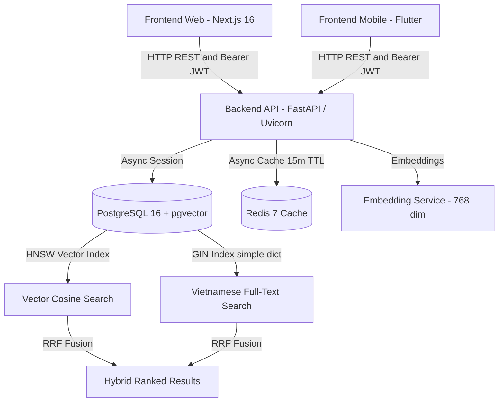

# Space247 - Nền Tảng Bất Động Sản Trí Tuệ Nhân Tạo (AI Real Estate Platform)

Space247 là nền tảng công nghệ bất động sản (PropTech) thế hệ mới tích hợp **AI Semantic Search (Tìm kiếm ngữ nghĩa)** và **Hybrid Search (Vector Cosine + Full-Text Search RRF)**, mang đến trải nghiệm tìm kiếm và kết nối bất động sản thông minh, trực quan và tốc độ cao.

---

## 1. Kiến Trúc Tổng Quan (System Architecture)



* **Backend**: Python 3.11+, FastAPI, SQLAlchemy 2.0 Async, Pydantic v2, Alembic, FastEmbed (`sentence-transformers/paraphrase-multilingual-mpnet-base-v2` / `multilingual-e5-base`, vector 768 chiều).
* **Cache Layer**: Redis 7 với driver `redis-py` async: cache kết quả tìm kiếm ngữ nghĩa/hybrid (`cache:search:*`) và chi tiết bất động sản (`cache:property:*`) TTL 15 phút, tự động xóa/invalidate cache khi có thay đổi dữ liệu.
* **Database**: PostgreSQL 16 tích hợp extension `pgvector`, chỉ mục HNSW (`m=16, ef_construction=64, vector_cosine_ops`) kết hợp Full-Text Search GIN index đa trường.
* **Frontend Web**: Next.js 16.3.4 (App Router), React 19, TypeScript, Tailwind CSS v4, Lucide Icons, Leaflet / React-Leaflet tương tác bản đồ.
* **Authentication**: JWT Bearer Token (HS256) chuẩn bảo mật với `bcrypt` hashing, phân quyền Role (`user`, `agent`, `admin`).
* **Shared SDK**: Bộ DTOs và TypeScript API Client tại `frontend/shared/` dùng chung đa nền tảng (Web & Mobile).

---

## 2. Yêu Cầu Môi Trường (Prerequisites)

Trước khi khởi chạy hệ thống, đảm bảo máy tính đã cài đặt:

* **Docker & Docker Compose**: Để chạy PostgreSQL 16 có extension `pgvector`.
* **Python >= 3.11** & trình quản lý gói **`uv`**: Cài đặt nhanh qua:
  * Windows: `powershell -ExecutionPolicy ByPass -c "irm https://astral.sh/uv/install.ps1 | iex"`
  * Linux/macOS: `curl -LsSf https://astral.sh/uv/install.sh | sh`
* **Node.js >= 20.x** & **npm** (khuyên dùng Node 20 LTS hoặc 22 LTS).

---

## 3. Khởi Chạy Nhanh Một Chạm (One-Click Quick Start)

Space247 cung cấp các bộ script tự động hoá toàn bộ quy trình: khởi động Docker container, đợi kết nối cơ sở dữ liệu, migrate database schema, và bật đồng thời cả backend và frontend:

### Trên Windows (PowerShell):
```powershell
.\scripts\start-dev.ps1
```

### Trên Linux / macOS (Bash):
```bash
chmod +x scripts/*.sh
./scripts/start-dev.sh
```

Sau khi khởi chạy:
* **Frontend Web**: [http://localhost:3000](http://localhost:3000)
* **Backend API**: [http://localhost:8080](http://localhost:8080)
* **Swagger API Docs (Interactive)**: [http://localhost:8080/api/v1/docs](http://localhost:8080/api/v1/docs)

---

## 4. Hướng Dẫn Thiết Lập Từng Bước Thủ Công (Manual Setup)

Nếu bạn muốn kiểm soát chi tiết từng dịch vụ, hãy làm theo các bước dưới đây:

### Bước 1: Khởi động Cơ sở dữ liệu PostgreSQL + pgvector và Redis Cache
```bash
docker compose up -d postgres redis
```
Kiểm tra container đang chạy:
```bash
docker ps
```

### Bước 2: Cấu hình Môi trường Backend
```bash
cd backend
cp .env.example .env
```
*(Nếu cần, cập nhật chuỗi kết nối `DATABASE_URL` hoặc `SECRET_KEY` trong file `.env`)*

### Bước 3: Đồng bộ Schema Database (Alembic Migration)
```bash
cd backend
uv run alembic upgrade head
```

### Bước 4: Nạp Dữ liệu Mẫu (Database Seeding)
Chạy script nạp tài khoản mẫu (`admin`, `agent`) và hơn 28 bất động sản thực tế có vector embedding 768 chiều:

* **Sử dụng script một chạm**:
  * Windows: `.\scripts\seed-data.ps1`
  * Linux/macOS: `./scripts/seed-data.sh`
* **Hoặc chạy trực tiếp qua Python**:
  ```bash
  cd backend
  uv run python -m scripts.seed_properties
  ```

> [!NOTE]
> Script seeding được thiết kế an toàn và **idempotent**: bạn có thể chạy lại nhiều lần mà không bị trùng lặp dữ liệu.

**Tài khoản mẫu được tạo tự động:**
* **Quản trị viên (Admin)**: `admin@space247.vn` | Mật khẩu: `Password123@`
* **Môi giới (Agent)**: `agent@space247.vn` | Mật khẩu: `Password123@`

### Bước 5: Khởi động Backend Server
```bash
cd backend
uv run uvicorn src.main:app --host 0.0.0.0 --port 8080 --reload
```

### Bước 6: Khởi động Frontend Web Client
```bash
cd frontend/web
cp .env.example .env.local
npm install
npm run dev
```
Mở trình duyệt truy cập: [http://localhost:3000](http://localhost:3000)

---

## 5. Danh Sách Endpoint API Chính (API Reference)

Tất cả các endpoint được tiền tố bởi `/api/v1`. Tài liệu tương tác đầy đủ có sẵn tại Swagger UI: `http://localhost:8080/api/v1/docs`.

| Phương thức | Endpoint | Yêu cầu Xác thực | Mô tả chi tiết |
| :--- | :--- | :---: | :--- |
| **GET** | `/api/v1/health` | Không | Kiểm tra trạng thái hệ thống, database & pgvector |
| **POST** | `/api/v1/auth/register` | Không | Đăng ký tài khoản mới (`user` / `agent`), trả về JWT Bearer token |
| **POST** | `/api/v1/auth/login` | Không | Đăng nhập bằng Email & Password, trả về JWT Token |
| **GET** | `/api/v1/auth/me` | Có (Bearer) | Lấy thông tin hồ sơ tài khoản người dùng đang đăng nhập |
| **GET** | `/api/v1/properties` | Không | Danh sách bất động sản với phân trang và bộ lọc cơ bản |
| **GET** | `/api/v1/properties/{id}` | Không | Xem chi tiết bài đăng bất động sản theo ID |
| **POST** | `/api/v1/properties` | Có (Bearer) | Đăng tin bất động sản mới (tự động tạo vector 768-dim & gán owner) |
| **PUT** | `/api/v1/properties/{id}` | Có (Bearer) | Cập nhật thông tin bất động sản (tự cập nhật lại vector nếu sửa nội dung) |
| **GET** | `/api/v1/properties/my` | Có (Bearer) | Danh sách bài đăng bất động sản do chính người dùng hiện tại tạo |
| **GET** | `/api/v1/properties/favorites` | Có (Bearer) | Danh sách bất động sản đã lưu / đánh dấu yêu thích của người dùng |
| **POST** | `/api/v1/properties/{id}/favorite` | Có (Bearer) | Bật / tắt (Toggle) lưu bài đăng bất động sản vào danh sách yêu thích |
| **POST** | `/api/v1/properties/search` | Không | **Hybrid Search**: Nhận câu hỏi tự nhiên tiếng Việt, kết hợp Vector Cosine + Full-Text Search qua RRF và lọc giá/diện tích/phòng ngủ |
| **POST** | `/api/v1/search/semantic` | Không | Tìm kiếm thuần vector embedding 768 chiều |

---

## 6. Kiểm Thử (Testing & Quality Assurance)

### Kiểm thử Backend (Pytest):
```bash
cd backend
uv run pytest
```
*Bao gồm hơn 55 test cases bao phủ Alembic migrations, JWT Auth, Hybrid Search RRF, Semantic Search, Redis Caching và Seeding logic.*

### Kiểm thử Frontend Web (TypeScript & Build):
```bash
cd frontend/web
npx tsc --noEmit
npm run build
```

### Khởi chạy Ứng dụng Di động (Flutter Mobile):
```bash
cd frontend/mobile
flutter pub get
flutter test
# Khởi chạy trên Android Emulator hoặc iOS Simulator / Thiết bị thật
flutter run
# Hoặc truyền URL API backend tùy chỉnh:
flutter run --dart-define=API_BASE_URL=http://10.0.2.2:8080/api/v1
```

---

## 7. Cấu Trúc Thư Mục Dự Án (Repository Structure)

```
Space247/
├── backend/                  # FastAPI Application & Database layer
│   ├── migrations/           # Alembic asyncpg migration versions
│   ├── scripts/              # Data seeding & utility scripts
│   ├── src/
│   │   ├── api/              # API router, endpoints (auth, properties, search) & dependencies
│   │   ├── core/             # Configuration, Database engine, Cache (Redis), Security (JWT/bcrypt)
│   │   ├── models/           # SQLAlchemy models (User, Property)
│   │   ├── schemas/          # Pydantic v2 request/response schemas
│   │   └── services/         # Embedding service (768-dim FastEmbed)
│   └── tests/                # Automated pytest suite (Alembic, Auth, Cache, Search, Seeding)
├── frontend/
│   ├── shared/               # Shared TypeScript SDK, DTOs & API Client
│   ├── web/                  # Next.js 16.3.4 App Router Web Application
│   └── mobile/               # Flutter Mobile Client (iOS & Android, Riverpod, Dio)
├── scripts/                  # One-click startup & standalone seed scripts
│   ├── start-dev.ps1         # Windows one-click starter
│   ├── start-dev.sh          # Linux/macOS one-click starter
│   ├── seed-data.ps1         # Windows standalone seeder
│   └── seed-data.sh          # Linux/macOS standalone seeder
├── docs/                     # Architecture & design specifications
├── docker-compose.yml        # PostgreSQL 16 + pgvector container definition
└── README.md                 # System overview and getting started guide
```

---

## 8. Giấy phép (License)
Dự án được phát triển cho hệ thống Space247 Real Estate Platform.
