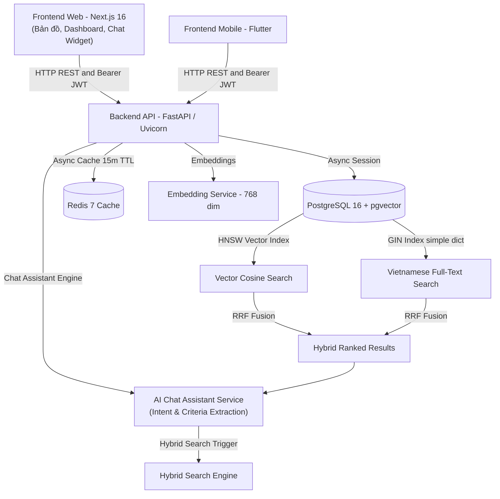

# Space247 - Nền Tảng Bất Động Sản Trí Tuệ Nhân Tạo (AI Real Estate Platform)

Space247 là nền tảng công nghệ bất động sản (PropTech) thế hệ mới tích hợp **Trợ lý AI Chatbot Tư Vấn Bất Động Sản Trực Tuyến**, **AI Semantic Search (Tìm kiếm ngữ nghĩa)** và **Hybrid Search (Vector Cosine + Full-Text Search RRF)**, mang đến trải nghiệm tìm kiếm và kết nối bất động sản thông minh, trực quan và tốc độ cao.

---

## 1. Kiến Trúc Tổng Quan (System Architecture)



* **Backend**: Python 3.11+, FastAPI, SQLAlchemy 2.0 Async, Pydantic v2, Alembic, FastEmbed (`sentence-transformers/paraphrase-multilingual-mpnet-base-v2`, vector 768 chiều).
* **AI Chat Assistant**: Trợ lý tư vấn bđs thông minh trích xuất tiêu chí (giá, vị trí, tiện ích, loại hình), tự động truy vấn cơ sở dữ liệu qua Hybrid Search RRF và phản hồi tự nhiên kèm thẻ bài đăng trực tiếp.
* **Cache Layer**: Redis 7 với driver `redis-py` async: cache kết quả tìm kiếm ngữ nghĩa/hybrid (`cache:search:*`) và chi tiết bất động sản (`cache:property:*`) TTL 15 phút, tự động xóa/invalidate cache khi có thay đổi dữ liệu.
* **Database**: PostgreSQL 16 tích hợp extension `pgvector`, chỉ mục HNSW (`m=16, ef_construction=64, vector_cosine_ops`) kết hợp Full-Text Search GIN index đa trường.
* **Frontend Web**: Next.js 16.3.4 (App Router), React 19, TypeScript, Tailwind CSS v4, Lucide Icons, Leaflet tương tác bản đồ và Floating Chat Widget hỗ trợ mở rộng toàn màn hình.
* **Authentication**: JWT Bearer Token (HS256) chuẩn bảo mật với `bcrypt` hashing, phân quyền Role (`user`, `agent`, `admin`).
* **Shared SDK**: Bộ DTOs và TypeScript API Client tại `frontend/shared/` dùng chung đa nền tảng (Web & Mobile).


---

## 2. Yêu Cầu Môi Trường (Prerequisites)

Trước khi khởi chạy hệ thống, đảm bảo máy tính đã cài đặt:

* **Docker & Docker Compose**: Để chạy PostgreSQL 16 có extension `pgvector`.
* **Python >= 3.11** & trình quản lý gói **`uv`**: Cài đặt nhanh qua:
  * Windows: `powershell -ExecutionPolicy ByPass -c "irm https://astral.sh/uv/install.ps1 | iex"`
  * Linux/macOS: `curl -LsSf https://astral.sh/uv/install.sh | sh`
* **Node.js >= 20.x** & **npm** (khuyên dùng Node 20 LTS hoặc 22 LTS).

---

## 3. Khởi Chạy Nhanh Một Chạm (One-Click Quick Start)

Space247 cung cấp các bộ script tự động hoá toàn bộ quy trình: khởi động Docker container, đợi kết nối cơ sở dữ liệu, migrate database schema, và bật đồng thời cả backend và frontend:

### Trên Windows (PowerShell):
```powershell
.\scripts\start-dev.ps1
```

### Trên Linux / macOS (Bash):
```bash
chmod +x scripts/*.sh
./scripts/start-dev.sh
```

Sau khi khởi chạy:
* **Frontend Web**: [http://localhost:3000](http://localhost:3000)
* **Backend API**: [http://localhost:8080](http://localhost:8080)
* **Swagger API Docs (Interactive)**: [http://localhost:8080/api/v1/docs](http://localhost:8080/api/v1/docs)

---

## 4. Hướng Dẫn Thiết Lập Từng Bước Thủ Công (Manual Setup)

Nếu bạn muốn kiểm soát chi tiết từng dịch vụ, hãy làm theo các bước dưới đây:

### Bước 1: Khởi động Cơ sở dữ liệu PostgreSQL + pgvector và Redis Cache
```bash
docker compose up -d postgres redis
```
Kiểm tra container đang chạy:
```bash
docker ps
```

### Bước 2: Cấu hình Môi trường Backend
```bash
cd backend
cp .env.example .env
```
*(Nếu cần, cập nhật chuỗi kết nối `DATABASE_URL` hoặc `SECRET_KEY` trong file `.env`)*

### Bước 3: Đồng bộ Schema Database (Alembic Migration)
```bash
cd backend
uv run alembic upgrade head
```

### Bước 4: Nạp Dữ liệu Mẫu (Database Seeding)
Chạy script nạp tài khoản mẫu (`admin`, `agent`) và hơn 28 bất động sản thực tế có vector embedding 768 chiều:

* **Sử dụng script một chạm**:
  * Windows: `.\scripts\seed-data.ps1`
  * Linux/macOS: `./scripts/seed-data.sh`
* **Hoặc chạy trực tiếp qua Python**:
  ```bash
  cd backend
  uv run python -m scripts.seed_properties
  ```

> [!NOTE]
> Script seeding được thiết kế an toàn và **idempotent**: bạn có thể chạy lại nhiều lần mà không bị trùng lặp dữ liệu.

**Tài khoản mẫu được tạo tự động:**
* **Quản trị viên (Admin)**: `admin@space247.vn` | Mật khẩu: `Password123@`
* **Môi giới (Agent)**: `agent@space247.vn` | Mật khẩu: `Password123@`

### Bước 5: Khởi động Backend Server
```bash
cd backend
uv run uvicorn src.main:app --host 0.0.0.0 --port 8080 --reload
```

### Bước 6: Khởi động Frontend Web Client
```bash
cd frontend/web
cp .env.example .env.local
npm install
npm run dev
```
Mở trình duyệt truy cập: [http://localhost:3000](http://localhost:3000)

---

## 5. Danh Sách Endpoint API Chính (API Reference)

Tất cả các endpoint được tiền tố bởi `/api/v1`. Tài liệu tương tác đầy đủ có sẵn tại Swagger UI: `http://localhost:8080/api/v1/docs`.

| Phương thức | Endpoint | Yêu cầu Xác thực | Mô tả chi tiết |
| :--- | :--- | :---: | :--- |
| **GET** | `/api/v1/health` | Không | Kiểm tra trạng thái hệ thống, database & pgvector |
| **POST** | `/api/v1/auth/register` | Không | Đăng ký tài khoản mới (`user` / `agent`), trả về JWT Bearer token |
| **POST** | `/api/v1/auth/login` | Không | Đăng nhập bằng Email & Password, trả về JWT Token |
| **GET** | `/api/v1/auth/me` | Có (Bearer) | Lấy thông tin hồ sơ tài khoản người dùng đang đăng nhập |
| **GET** | `/api/v1/properties` | Không | Danh sách bất động sản với phân trang và bộ lọc cơ bản |
| **GET** | `/api/v1/properties/{id}` | Không | Xem chi tiết bài đăng bất động sản theo ID |
| **POST** | `/api/v1/properties` | Có (Bearer) | Đăng tin bất động sản mới (tự động tạo vector 768-dim & gán owner) |
| **PUT** | `/api/v1/properties/{id}` | Có (Bearer) | Cập nhật thông tin bất động sản (tự cập nhật lại vector nếu sửa nội dung) |
| **GET** | `/api/v1/properties/my` | Có (Bearer) | Danh sách bài đăng bất động sản do chính người dùng hiện tại tạo |
| **GET** | `/api/v1/properties/favorites` | Có (Bearer) | Danh sách bất động sản đã lưu / đánh dấu yêu thích của người dùng |
| **POST** | `/api/v1/properties/{id}/favorite` | Có (Bearer) | Bật / tắt (Toggle) lưu bài đăng bất động sản vào danh sách yêu thích |
| **POST** | `/api/v1/properties/search` | Không | **Hybrid Search**: Nhận câu hỏi tự nhiên tiếng Việt, kết hợp Vector Cosine + Full-Text Search qua RRF và lọc giá/diện tích/phòng ngủ |
| **POST** | `/api/v1/search/semantic` | Không | Tìm kiếm thuần vector embedding 768 chiều |
| **POST** | `/api/v1/chat/assistant` | Không | **Trợ lý AI Tư vấn**: Nhận lịch sử chat & câu hỏi tự nhiên, tự động trích xuất tiêu chí (giá, quận, loại hình, tiện ích), gọi Hybrid Search và trả về phản hồi tự nhiên kèm thẻ bài đăng |
| **POST** | `/api/v1/properties/compare` | Không | **So sánh BĐS bằng AI**: So sánh 2-3 căn trực tiếp theo 4 tiêu chí cốt lõi (đơn giá/m², vị trí, tiềm năng, pháp lý) |
| **POST** | `/api/v1/spatial/isochrone-search` | Không | Tìm kiếm BĐS theo bán kính thời gian di chuyển thực tế (Isochrone Travel-Time Polygon) |
| **GET** | `/api/v1/spatial/amenities/heatmap` | Không | Bản đồ nhiệt mật độ tiện ích xung quanh (Trường học, Bệnh viện, Ga Metro, Siêu thị) |
| **POST** | `/api/v1/agent/listing/generate` | Có (Agent/Admin) | **AI Listing Co-Pilot**: Soạn tin đăng chuẩn SEO, sinh bài viết Markdown và bóc tách thông số từ ghi chú hoặc ảnh sổ đỏ |
| **POST** | `/api/v1/agent/valuation/estimate` | Có (Agent/Admin) | **Smart AVM Pricing Advisor**: Định giá BĐS tự động dựa trên giao dịch lân cận (Weighted KNN + mở rộng bán kính 2.5-8km) |

---

## 6. Kiểm Thử (Testing & Quality Assurance)

### Kiểm thử Backend (Pytest):
```bash
cd backend
uv run pytest
```
*Bao gồm toàn bộ **90 test cases** (100% PASS) bao phủ Agent AI Co-Pilot (Listing Generator, AVM Valuation, Auth RBAC), PostGIS Spatial Isochrone Search & Amenity Heatmaps, AI Property Comparison, AI Chatbot Assistant, Alembic migrations, JWT Auth, Hybrid Search RRF, Semantic Search, Redis Caching và Seeding logic.*

### Bộ Công Cụ Môi Giới Thông Minh (Agent AI Co-Pilot):
Space247 trang bị bộ công cụ AI Co-Pilot đắc lực dành riêng cho môi giới (`agent`) và quản trị viên (`admin`):
1. **AI Listing Generator**:
   * Phân tích ghi chú nhanh hoặc ảnh chụp sổ đỏ/mặt bằng qua Gemini Multimodal AI.
   * Tự động sinh tiêu đề chuẩn SEO, bài viết Markdown chuyên nghiệp theo văn phong bất động sản Việt Nam.
   * Tự động trích xuất thông số kỹ thuật (diện tích, phòng ngủ, WC, hướng nhà, pháp lý, mặt tiền, giá gợi ý, tiện ích) và điền tự động vào Form tạo/sửa tin đăng.
2. **Smart AVM Pricing Advisor (Automated Valuation Model)**:
   * Ứng dụng PostGIS và thuật toán Weighted K-Nearest Neighbors (suy giảm theo khoảng cách $d^{1.5}$, tỷ lệ diện tích và số phòng ngủ).
   * **Option A: Bán kính tìm kiếm linh hoạt**: Mặc định tìm kiếm trong bán kính 2.5 km; tự động mở rộng từng bước (lên tối đa 6.0 – 8.0 km) nếu ít hơn 2 BĐS tương đồng. Tự động hiệu chỉnh giảm điểm tin cậy (*confidence score*) và ghi chú rõ ràng cho môi giới.
   * Thanh đo trực quan 3 mức độ lệch giá: Thấp hơn thị trường (thanh khoản cao), Định giá hợp lý (chuẩn thị trường), Cao hơn thị trường (cảnh báo khó bán).
   * Tích hợp bộ nhớ đệm Redis (TTL 15 phút) tối ưu hiệu năng tính toán.

### Tính năng Địa Không Gian & Bản Đồ (Spatial & Geo-Intelligence):
Space247 tích hợp công nghệ PostGIS với chỉ mục không gian GiST (SRID 4326) và hệ thống phân tích không gian thông minh:
1. **Tìm kiếm BĐS theo vùng di chuyển thực tế (Isochrone Travel-Time Search)**:
   * Endpoint: `POST /api/v1/spatial/isochrone-search`
   * Geocoding các mốc địa danh hàng đầu Việt Nam (Keangnam, Chợ Bến Thành, Landmark 81, ĐH Bách Khoa, Hồ Gươm, Lotte Center...) hoặc tọa độ trực tiếp kèm OpenStreetMap Nominatim.
   * Tạo đa giác di chuyển GeoJSON đa giác (5 - 30 phút) theo phương tiện: Xe máy (28 km/h), Ô tô (32 km/h), Đi bộ (4.5 km/h).
   * Lọc chính xác các căn hộ nằm trong vùng bằng `ST_Within(Property.geom, ST_GeomFromGeoJSON(:polygon))`.
2. **Bản đồ nhiệt mật độ tiện ích xung quanh (Amenity Density Heatmap)**:
   * Endpoint: `GET /api/v1/spatial/amenities/heatmap?category={school|hospital|metro|supermarket|all}`
   * Trả về danh sách POI kèm ma trận tọa độ trọng số `[lat, lng, weight]` cho `leaflet.heat` và markers tương tác.
3. **Bộ nhớ đệm Redis**: Tự động cache Isochrone Polygons và POI data trong 1 giờ.

### Kiểm thử Frontend Web (TypeScript & Build):
```bash
cd frontend/web
npx tsc --noEmit
npm run build
```

### Khởi chạy Ứng dụng Di động (Flutter Mobile):
```bash
cd frontend/mobile
flutter pub get
flutter test
# Khởi chạy trên Android Emulator hoặc iOS Simulator / Thiết bị thật
flutter run
# Hoặc truyền URL API backend tùy chỉnh:
flutter run --dart-define=API_BASE_URL=http://10.0.2.2:8080/api/v1
```

---

## 7. Cấu Trúc Thư Mục Dự Án (Repository Structure)

```
Space247/
├── backend/                  # FastAPI Application & Database layer
│   ├── migrations/           # Alembic asyncpg migration versions
│   ├── scripts/              # Data seeding & utility scripts
│   ├── src/
│   │   ├── api/              # API router, endpoints (auth, properties, search, chat) & dependencies
│   │   ├── core/             # Configuration, Database engine, Cache (Redis), Security (JWT/bcrypt)
│   │   ├── models/           # SQLAlchemy models (User, Property)
│   │   ├── schemas/          # Pydantic v2 schemas (property, user, chat)
│   │   └── services/         # Embedding (FastEmbed 768-dim) & AI Chat Assistant Service
│   └── tests/                # Automated pytest suite (Chat Assistant, Alembic, Auth, Cache, Search, Seeding)
├── frontend/
│   ├── shared/               # Shared TypeScript SDK, DTOs & API Client
│   ├── web/                  # Next.js 16.3.4 App Router Web Application
│   │   ├── src/components/   # ChatAssistantWidget (mở rộng/thu nhỏ, format đẹp), Navbar, PropertyMap...
│   │   └── src/app/          # App router pages (Trang chủ, chi tiết, quản lý tin đăng, favorites)
│   └── mobile/               # Flutter Mobile Client (iOS & Android, Riverpod, Dio)
├── scripts/                  # One-click startup & standalone seed scripts
│   ├── start-dev.ps1         # Windows one-click starter
│   ├── start-dev.sh          # Linux/macOS one-click starter
│   ├── seed-data.ps1         # Windows standalone seeder
│   └── seed-data.sh          # Linux/macOS standalone seeder
├── docs/                     # Architecture & design specifications (01-04)
│   └── architecture/         # System overview, Data model, Frontend & AI Chat Assistant specs
├── docker-compose.yml        # PostgreSQL 16 + pgvector & Redis container definition
└── README.md                 # System overview and getting started guide
```


---

## 8. Giấy phép (License)
Dự án được phát triển cho hệ thống Space247 Real Estate Platform.
