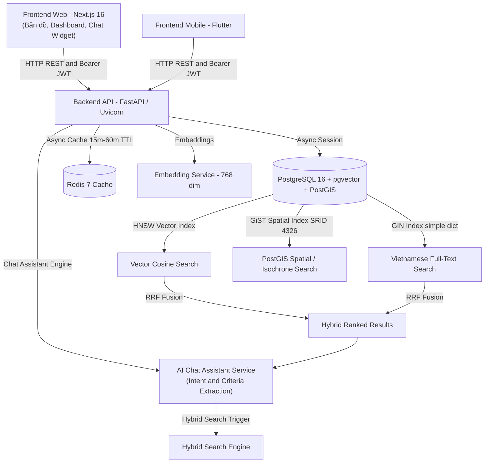

# Space247 — Nền Tảng Bất Động Sản Trí Tuệ Nhân Tạo

Space247 là nền tảng công nghệ bất động sản (PropTech) tích hợp Trợ lý Trí tuệ nhân tạo (AI Chat Assistant), Tìm kiếm ngữ nghĩa (Semantic Search) và Tìm kiếm lai (Hybrid Search kết hợp Vector Cosine và Full-Text Search qua thuật toán Reciprocal Rank Fusion - RRF). Hệ thống cung cấp giải pháp tra cứu, định giá tự động và kết nối giao dịch bất động sản với hiệu năng cao.

---

## 1. Kiến Trúc Tổng Quan (System Architecture)



- **Backend**: Python 3.11+, FastAPI, SQLAlchemy 2.0 Async, Pydantic v2, Alembic, FastEmbed (`sentence-transformers/paraphrase-multilingual-mpnet-base-v2`, vector 768 chiều).
- **AI Chat Assistant**: Trợ lý tư vấn bất động sản tự động — trích xuất tiêu chí tìm kiếm (khoảng giá, vị trí, tiện ích, loại hình), thực hiện truy vấn cơ sở dữ liệu qua Hybrid Search RRF và phản hồi tự nhiên kèm thẻ bài đăng trực tiếp.
- **Cache Layer**: Redis 7 async — lưu cache tìm kiếm ngữ nghĩa/hybrid (`cache:search:*`), chi tiết bất động sản (`cache:property:*`) với thời gian sống (TTL) 15 phút; dữ liệu Isochrone và POI có TTL 60 phút.
- **Database**: PostgreSQL 16 với phần mở rộng `pgvector` (chỉ mục HNSW) + `PostGIS` (chỉ mục không gian GiST hệ tọa độ SRID 4326) + Full-Text Search chỉ mục GIN đa trường ngôn ngữ tiếng Việt cấu hình từ điển `simple`.
- **Frontend Web**: Next.js 16.3.4 (App Router), React 19, TypeScript, Tailwind CSS v4, Lucide Icons, Leaflet, ReactMarkdown.
- **Frontend Mobile**: Flutter 3.x, Riverpod, Dio, CachedNetworkImage, FlutterMap.
- **Authentication**: Xác thực phân quyền JSON Web Token (JWT HS256) kết hợp hàm băm mật khẩu `bcrypt`, hỗ trợ phân quyền vai trò người dùng (`user`, `agent`, `admin`).
- **Shared SDK**: Khai báo kiểu dữ liệu TypeScript (DTOs) và API Client tại `frontend/shared/` dùng chung giữa Web và Mobile.

---

## 2. Yêu Cầu Môi Trường (Prerequisites)

| Phần mềm | Phiên bản yêu cầu | Mục đích sử dụng |
|---|---|---|
| Docker & Docker Compose | Phiên bản mới nhất | Chạy PostgreSQL (pgvector + PostGIS) và Redis |
| Python | >= 3.11 | Môi trường thực thi Backend FastAPI |
| uv | Phiên bản mới nhất | Trình quản lý môi trường và gói thư viện Python |
| Node.js | >= 20 LTS | Môi trường thực thi Frontend Web Next.js |
| Flutter SDK | >= 3.13 | Bộ công cụ phát triển ứng dụng di động Flutter |

**Cài đặt `uv`:**
```bash
# Linux / macOS
curl -LsSf https://astral.sh/uv/install.sh | sh

# Windows (PowerShell)
powershell -ExecutionPolicy ByPass -c "irm https://astral.sh/uv/install.ps1 | iex"
```

---

## 3. Khởi Động Nhanh (Quick Start)

```bash
# Khởi động dịch vụ cơ sở hạ tầng (PostgreSQL & Redis)
docker compose up -d postgres redis

# Khởi động script môi trường phát triển cục bộ (Linux / macOS)
chmod +x scripts/*.sh && ./scripts/start-dev.sh

# Khởi động trên Windows (PowerShell)
.\scripts\start-dev.ps1
```

Sau khi khởi chạy, các địa chỉ dịch vụ gồm:
| Dịch vụ | Địa chỉ URL |
|---|---|
| Frontend Web | http://localhost:3000 |
| Backend API | http://localhost:8080 |
| Tài liệu API tương tác (Swagger UI) | http://localhost:8080/api/v1/docs |
| Tài liệu thay thế (ReDoc) | http://localhost:8080/api/v1/redoc |

---

## 4. Hướng Dẫn Cài Đặt Từng Bước (Manual Setup)

### Bước 1: Khởi chạy cơ sở dữ liệu và cache
```bash
docker compose up -d postgres redis
```

### Bước 2: Thiết lập môi trường Backend
```bash
cd backend
cp .env.example .env
uv sync --all-extras
```

### Bước 3: Đồng bộ schema cơ sở dữ liệu qua Alembic
```bash
cd backend
uv run alembic upgrade head
```

Danh mục các bản di chuyển lược đồ (Migrations):
| Bản di chuyển | Mã tệp | Nội dung chi tiết |
|---|---|---|
| `0001` | `0001_initial_pgvector_properties.py` | Tạo bảng `properties`, kích hoạt pgvector, PostGIS, chỉ mục HNSW và GiST |
| `0002` | `0002_add_users_table_and_property_user_fk.py` | Tạo bảng `users`, liên kết khóa ngoại `user_id` trong `properties` |
| `0003` | `0003_add_favorite_properties.py` | Tạo bảng liên kết `favorite_properties` |
| `0004` | `0004_add_alerts_and_notifications.py` | Tạo bảng `saved_search_alerts` và `user_notifications` |
| `0005` | `0005_add_property_images_and_user_avatar.py` | Bổ sung cột `images TEXT[]` vào `properties` và `avatar_url VARCHAR` vào `users` |

### Bước 4: Nạp dữ liệu mẫu khởi tạo (Data Seeding)
```bash
cd backend
uv run python -m scripts.seed_properties
```
> Script seeding tuân thủ tính lũy đẳng (idempotent), không gây trùng lặp bản ghi khi chạy nhiều lần.

**Tài khoản quản trị và môi giới mặc định:**
| Vai trò | Email | Mật khẩu mặc định |
|---|---|---|
| Quản trị viên (Admin) | admin@space247.vn | Password123@ |
| Môi giới (Agent) | agent@space247.vn | Password123@ |

### Bước 5: Chạy Backend API
```bash
cd backend
uv run uvicorn src.main:app --host 0.0.0.0 --port 8080 --reload
```

### Bước 6: Khởi chạy Frontend Web
```bash
cd frontend/web
cp .env.example .env.local
npm install
npm run dev
```

### Bước 7: Khởi chạy ứng dụng di động Flutter (Tùy chọn)
```bash
cd frontend/mobile
flutter pub get
flutter run --dart-define=API_BASE_URL=http://10.0.2.2:8080/api/v1
```

---

## 5. Danh Mục Endpoints API (API Reference)

Toàn bộ các endpoint đều có tiền tố `/api/v1`. Tài liệu chuẩn OpenAPI được cung cấp tại `/api/v1/docs`.

### Xác thực & Người dùng (`/auth`)
| Phương thức | Endpoint | Yêu cầu xác thực | Mô tả chức năng |
|:---|:---|:---:|:---|
| POST | `/api/v1/auth/register` | Không | Đăng ký tài khoản người dùng mới, trả về token JWT |
| POST | `/api/v1/auth/login` | Không | Đăng nhập tài khoản, xác thực mật khẩu bcrypt và cấp token JWT |
| GET | `/api/v1/auth/me` | Có (Bearer) | Lấy thông tin tài khoản đang đăng nhập |
| PUT | `/api/v1/auth/me` | Có (Bearer) | Cập nhật hồ sơ (`full_name`, `phone`, `avatar_url`) |

### Bất động sản (`/properties`)
| Phương thức | Endpoint | Yêu cầu xác thực | Mô tả chức năng |
|:---|:---|:---:|:---|
| GET | `/api/v1/properties` | Không | Danh sách bất động sản có phân trang và bộ lọc thuộc tính |
| POST | `/api/v1/properties` | Có (Bearer) | Đăng tin mới (tự động tạo embedding 768 chiều, gán quyền sở hữu, lưu mảng ảnh) |
| GET | `/api/v1/properties/{id}` | Không | Xem chi tiết bất động sản kèm danh sách ảnh, tọa độ và thông tin người đăng |
| PUT | `/api/v1/properties/{id}` | Có (Bearer) | Cập nhật tin đăng (tự động tính lại embedding khi nội dung thay đổi) |
| GET | `/api/v1/properties/my` | Có (Bearer) | Danh sách tin đăng do chính người dùng hiện tại quản lý |
| GET | `/api/v1/properties/favorites` | Có (Bearer) | Danh sách bất động sản đã đánh dấu yêu thích |
| POST | `/api/v1/properties/{id}/favorite` | Có (Bearer) | Đánh dấu hoặc hủy đánh dấu yêu thích |
| POST | `/api/v1/properties/compare` | Không | So sánh chi tiết 2 đến 3 bất động sản theo đơn giá, diện tích, vị trí và tiềm năng |

### Tìm kiếm (`/search` & `/properties/search`)
| Phương thức | Endpoint | Yêu cầu xác thực | Mô tả chức năng |
|:---|:---|:---:|:---|
| POST | `/api/v1/properties/search` | Không | Tìm kiếm lai (Hybrid Search): kết hợp Vector Cosine và Full-Text qua RRF |
| POST | `/api/v1/search/semantic` | Không | Tìm kiếm ngữ nghĩa thuần vector embedding 768 chiều |

### Trợ lý Trí tuệ Nhân tạo (`/chat`)
| Phương thức | Endpoint | Yêu cầu xác thực | Mô tả chức năng |
|:---|:---|:---:|:---|
| POST | `/api/v1/chat/assistant` | Không | Xử lý ngôn ngữ tự nhiên, bóc tách tiêu chí tìm kiếm, truy vấn dữ liệu và phản hồi |

### Tiện ích Môi giới AI (`/agent`)
| Phương thức | Endpoint | Yêu cầu xác thực | Mô tả chức năng |
|:---|:---|:---:|:---|
| POST | `/api/v1/agent/listing/generate` | Có (Agent+) | Tự động tạo tiêu đề chuẩn SEO và mô tả tin đăng Markdown từ hình ảnh/thông số |
| POST | `/api/v1/agent/valuation/estimate` | Có (Agent+) | Mô hình AVM ước tính khoảng giá thị trường bằng thuật toán Weighted KNN bán kính 2.5-8 km |

### Không gian & Bản đồ (`/spatial`)
| Phương thức | Endpoint | Yêu cầu xác thực | Mô tả chức năng |
|:---|:---|:---:|:---|
| POST | `/api/v1/spatial/isochrone-search` | Không | Tìm bất động sản theo vùng di chuyển 5-30 phút theo phương tiện |
| GET | `/api/v1/spatial/amenities/heatmap` | Không | Trả về mật độ tiện ích xung quanh (trường học, bệnh viện, siêu thị, giao thông) |

### Công cụ Tài chính (`/financial`)
| Phương thức | Endpoint | Yêu cầu xác thực | Mô tả chức năng |
|:---|:---|:---:|:---|
| POST | `/api/v1/financial/mortgage-calc` | Không | Tính lịch trả góp ngân hàng theo phương thức niên kim hoặc dư nợ giảm dần |

### Quản lý Cảnh báo & Thông báo (`/alerts` & `/notifications`)
| Phương thức | Endpoint | Yêu cầu xác thực | Mô tả chức năng |
|:---|:---|:---:|:---|
| POST | `/api/v1/alerts` | Có (Bearer) | Đăng ký cảnh báo tự động khi có bất động sản mới phù hợp tiêu chí |
| GET | `/api/v1/alerts` | Có (Bearer) | Danh sách cảnh báo đang theo dõi của người dùng |
| PATCH | `/api/v1/alerts/{id}` | Có (Bearer) | Bật hoặc tắt trạng thái nhận thông báo của một cảnh báo |
| DELETE | `/api/v1/alerts/{id}` | Có (Bearer) | Xóa cảnh báo tìm kiếm |
| GET | `/api/v1/notifications` | Có (Bearer) | Danh sách thông báo nội bộ hệ thống gửi cho người dùng |
| POST | `/api/v1/notifications/read-all` | Có (Bearer) | Đánh dấu toàn bộ thông báo là đã đọc |

### Giám sát Hệ thống (`/health`)
| Phương thức | Endpoint | Yêu cầu xác thực | Mô tả chức năng |
|:---|:---|:---:|:---|
| GET | `/api/v1/health` | Không | Kiểm tra trạng thái hoạt động của ứng dụng, kết nối cơ sở dữ liệu và chỉ mục vector |

---

## 6. Kiểm Thử Hệ Thống (Testing & Quality Gates)

Hệ thống được bảo đảm chất lượng nghiêm ngặt thông qua các bộ kiểm thử tự động trên toàn bộ các tầng:

### Backend
```bash
cd backend
uv run pytest
```
- **Kết quả thực tế**: 101/101 tests PASS trên 14 bộ kiểm thử (test suites).
- **Phạm vi kiểm thử**: Di chuyển cơ sở dữ liệu Alembic (0001-0005), phân quyền bảo mật JWT, CRUD bất động sản kèm mảng ảnh, định giá AVM, tính toán bản đồ Isochrone PostGIS, so sánh BĐS, chatbot AI trích xuất tiêu chí, tìm kiếm lai RRF, cơ chế bộ nhớ đệm Redis, và cảnh báo nền.

### Frontend Web
```bash
cd frontend/web
npx tsc --noEmit   # 0 lỗi TypeScript
npm run build      # Biên dịch thành công 100% các tuyến đường tĩnh và động
```

### Frontend Mobile
```bash
cd frontend/mobile
flutter analyze    # 0 lỗi cú pháp, 0 cảnh báo nghiêm trọng
```

---

## 7. Cấu Trúc Mã Nguồn

```
Space247/
├── backend/
│   ├── migrations/versions/        # Tệp di chuyển lược đồ cơ sở dữ liệu Alembic (0001–0005)
│   ├── scripts/                    # Script nạp dữ liệu mẫu seed_properties.py
│   ├── src/
│   │   ├── api/v1/endpoints/       # auth, properties, search, chat, agent, spatial, financial, alerts, notifications, health
│   │   ├── core/                   # config, database, cache, security
│   │   ├── models/                 # Property, User (với geom PostGIS, embedding VECTOR, images TEXT[])
│   │   ├── schemas/                # Lược đồ dữ liệu Pydantic v2 chuẩn hóa
│   │   └── services/               # EmbeddingService, ChatAssistantService, AlertMatchingService, AIComparisonService
│   └── tests/                      # 101 ca kiểm thử đơn vị và tích hợp
├── frontend/
│   ├── shared/                     # DTOs TypeScript dùng chung (types.ts, api-client.ts)
│   ├── web/                        # Ứng dụng Next.js 16 App Router
│   │   ├── src/components/         # Thư viện thành phần giao diện người dùng
│   │   └── src/app/                # Định tuyến trang Next.js
│   └── mobile/                     # Ứng dụng di động Flutter
│       ├── lib/core/               # ApiClient, theme, hằng số cấu hình
│       ├── lib/models/             # Mô hình dữ liệu Dart
│       ├── lib/screens/            # Màn hình chức năng
│       └── lib/widgets/            # Thành phần giao diện tái sử dụng
├── docs/                           # Trung tâm tài liệu kỹ thuật chuẩn Enterprise
│   ├── project-overview.md         # Bối cảnh bài toán, phạm vi và chân dung người dùng
│   ├── system-architecture.md      # Kiến trúc phân tầng, luồng dữ liệu, chiến lược cache
│   ├── tech-stack.md               # Danh mục công nghệ và lý do lựa chọn
│   ├── database-design.md          # Lược đồ cơ sở dữ liệu, ERD và chiến lược chỉ mục
│   ├── api-specs.md                # Đặc tả toàn bộ API RESTful và cấu trúc dữ liệu
│   └── coding-standards-and-git-rules.md # Quy chuẩn lập trình, Git flow và Quality Gate
├── scripts/                        # Script khởi động tự động đa nền tảng
├── docker-compose.yml              # Cấu hình container PostgreSQL 16 + pgvector/PostGIS và Redis 7
└── README.md                       # Tài liệu tổng quan dự án
```

---

## 8. Lược Đồ Cơ Sở Dữ Liệu Tóm Tắt (Revision 0005)

| Tên bảng | Các trường chính và kiểu dữ liệu | Chỉ mục chính |
|---|---|---|
| `properties` | `id`, `title`, `description`, `price`, `area_sqm`, `address`, `city`, `district`, `ward`, `latitude`, `longitude`, `geom (geometry(Point, 4326))`, `images (TEXT[])`, `embedding (VECTOR(768))`, `user_id (FK)`, `status` | HNSW (`vector_cosine_ops`), GiST (`geom`), GIN (Full-Text tiếng Việt), B-Tree (`city`, `price`, `area_sqm`) |
| `users` | `id`, `email`, `hashed_password`, `full_name`, `phone`, `avatar_url`, `role`, `is_active`, `created_at` | Unique B-Tree (`email`), B-Tree (`role`) |
| `favorite_properties` | `user_id (FK)`, `property_id (FK)`, `created_at` | Composite Primary Key (`user_id`, `property_id`) |
| `saved_search_alerts` | `id`, `user_id (FK)`, `title`, `criteria (JSONB)`, `frequency`, `is_active`, `last_notified_at` | B-Tree (`user_id`), B-Tree (`is_active`) |
| `user_notifications` | `id`, `user_id (FK)`, `alert_id (FK)`, `property_id (FK)`, `title`, `message`, `is_read`, `created_at` | B-Tree (`user_id`), B-Tree (`is_read`) |

---

## 9. Giấy Phép (License)

Dự án Space247 được phát triển dưới bản quyền nội bộ phục vụ hệ thống công nghệ bất động sản Space247 Platform.
