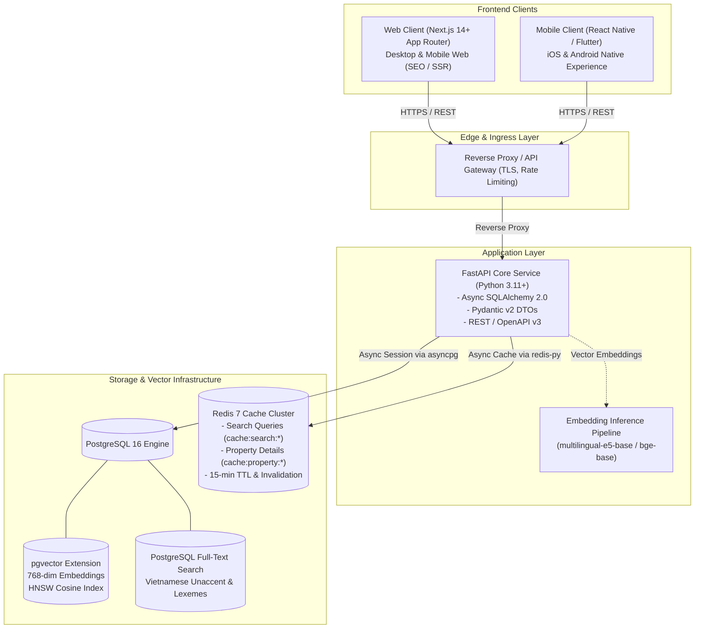

# Space247 Architecture Document 01: System Overview

## 1. Executive Summary & Intent

The Space247 Platform (Nền tảng Bất Động Sản Bán & Cho Thuê Space247) delivers high-throughput real estate listings, advanced multi-criteria filtering, and AI-powered semantic search tailored for the Vietnamese real estate market. The platform bridges buyers, renters, brokers, and landlords through modern web and mobile touchpoints backed by an asynchronous Python backend and PostgreSQL vector database infrastructure.

## 2. High-Level Architecture Topology

## 3. Core Component Responsibilities

| Component | Technology | Primary Responsibilities |
|-----------|------------|--------------------------|
| **Backend API** | FastAPI, Python >=3.11, Uvicorn | High-performance asynchronous REST endpoints, request validation, business logic, semantic search orchestration. |
| **Cache Layer** | Redis 7, `redis-py` (asyncio) | High-speed in-memory response caching for semantic search queries and property details with proactive invalidation on mutations. |
| **Vector Database** | PostgreSQL 16 + `pgvector` | Persistent relational property storage, transactional integrity, 768-dimensional vector embeddings, HNSW indexing. |
| **Web Frontend** | Next.js 14+ (App Router), TypeScript | Server-Side Rendering (SSR) for search engine indexing, property discovery, interactive listings, broker portals. |
| **Mobile Frontend** | React Native / Flutter | Native iOS and Android apps, geolocation search, push notifications, saved listing offline caching. |
| **Shared Contracts** | TypeScript (`frontend/shared/`) | Single source of truth for DTO schemas, API client methods, and validation rules across frontend targets. |

## 4. Architecture Decision Records (ADRs)

### ADR-001: Adoption of Asynchronous FastAPI with asyncpg
- **Status:** Accepted
- **Context:** Real estate discovery platforms experience high concurrency during peak browsing hours. Synchronous blocking I/O can cause thread exhaustion under heavy concurrent search loads.
- **Decision:** Use FastAPI with asynchronous SQLAlchemy 2.0 and the `asyncpg` PostgreSQL driver.
- **Consequences:** Maximizes throughput per node; enforces strict separation between async routes and background tasks; requires non-blocking database queries throughout the application.

### ADR-002: Vector Dimension Standardization to 768
- **Status:** Accepted
- **Context:** Vietnamese property listings require dense semantic embeddings capable of matching colloquial phrases (e.g., *"nhà hẻm xe hơi", "view sông thoáng mát", "gần trường học"*) with structured attributes.
- **Decision:** Standardize vector dimension at 768 (`VECTOR_DIM=768`), aligning with multilingual open-weight embedding models such as `multilingual-e5-base` and `bge-base-multilingual`.
- **Consequences:** Database storage and index structures are pre-configured for 768 floats; API rejects incompatible vector dimensions immediately at the gateway layer.

### ADR-003: Decoupled Multi-Platform Frontend with Shared Contracts
- **Status:** Accepted
- **Context:** Different client form factors (SEO-critical Web vs gesture-driven Mobile) require specialized rendering patterns, but divergence in API data contracts leads to integration failures.
- **Decision:** Scaffold independent client projects (`frontend/web`, `frontend/mobile`) powered by a centralized typed contract module (`frontend/shared`).
- **Consequences:** Web and mobile teams work in parallel without code collision; breaking backend API changes are caught at compile time via shared TypeScript interfaces.
