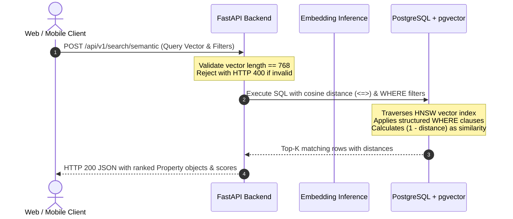
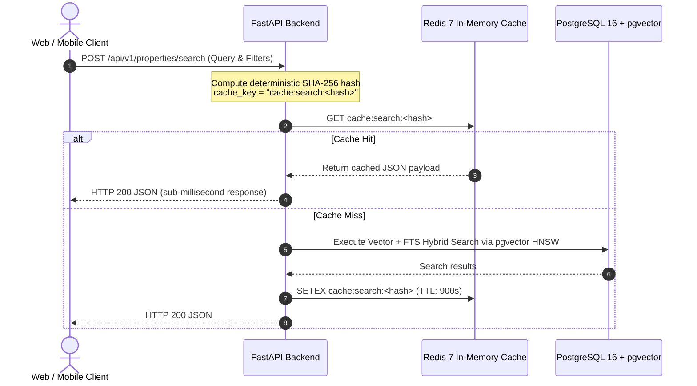

# Space247 Architecture Document 02: Data Model and Vector Search

## 1. Relational and Vector Schema Design

The `properties` table combines structured relational attributes (price, location, property type, listing type) with a 768-dimensional dense vector embedding column managed by `pgvector`.

### Database Schema Definition (SQL DDL)

```sql
-- Enable pgvector extension
CREATE EXTENSION IF NOT EXISTS vector;
CREATE EXTENSION IF NOT EXISTS "uuid-ossp";

-- Property listing table
CREATE TABLE properties (
    id UUID PRIMARY KEY DEFAULT uuid_generate_v4(),
    title VARCHAR(255) NOT NULL,
    description TEXT NOT NULL,
    property_type VARCHAR(50) NOT NULL,    -- apartment, house, villa, land, commercial
    listing_type VARCHAR(20) NOT NULL,     -- sale, rent
    price NUMERIC(15, 2) NOT NULL,         -- Price in VND
    currency VARCHAR(10) NOT NULL DEFAULT 'VND',
    area_sqm DOUBLE PRECISION NOT NULL,    -- Area in m²
    num_bedrooms INTEGER,
    num_bathrooms INTEGER,
    address VARCHAR(500) NOT NULL,
    ward VARCHAR(100),
    district VARCHAR(100),
    city VARCHAR(100) NOT NULL,
    latitude DOUBLE PRECISION,
    longitude DOUBLE PRECISION,
    status VARCHAR(20) NOT NULL DEFAULT 'active',
    embedding vector(768),                 -- 768-dim semantic embedding
    created_at TIMESTAMP WITH TIME ZONE DEFAULT NOW() NOT NULL,
    updated_at TIMESTAMP WITH TIME ZONE DEFAULT NOW() NOT NULL
);

-- Relational indexes for high-speed attribute filtering
CREATE INDEX idx_properties_listing_type ON properties(listing_type);
CREATE INDEX idx_properties_property_type ON properties(property_type);
CREATE INDEX idx_properties_city ON properties(city);
CREATE INDEX idx_properties_district ON properties(district);
CREATE INDEX idx_properties_price ON properties(price);
CREATE INDEX idx_properties_area_sqm ON properties(area_sqm);
CREATE INDEX idx_properties_status ON properties(status);
```

## 2. Vector Indexing Strategy: HNSW vs. IVFFlat

For production similarity queries over 768-dimensional embeddings, we evaluate two index structures supported by `pgvector`:

| Feature | HNSW (Hierarchical Navigable Small World) | IVFFlat (Inverted File Flat) |
|---------|------------------------------------------|-----------------------------|
| **Recall / Accuracy** | High (>= 98% recall) | Moderate to High (~90-95%) |
| **Search Latency** | Low (< 5ms at 1M vectors) | Medium (increases with list scan) |
| **Build Time & Memory** | Higher memory footprint and build time | Lower memory, faster build |
| **Training Requirement** | No training step required; inserts update graph dynamically | Requires pre-populated table for k-means centroid clustering |
| **Recommendation** | **Primary Choice for Production Real Estate Search** | Fallback for resource-constrained local development |

### HNSW Index Creation

```sql
CREATE INDEX idx_properties_embedding_hnsw ON properties 
USING hnsw (embedding vector_cosine_ops)
WITH (m = 16, ef_construction = 64);
```

- `m = 16`: Number of bi-directional links created for each new node. Provides an optimal balance between index size and graph traversal speed.
- `ef_construction = 64`: Size of the dynamic candidate list during graph construction. Higher values yield better recall at construction time.

## 3. Semantic Search Pipeline



## 4. Hybrid Search Architecture (FTS + Vector)

In Vietnamese real estate discovery, user intent often couples specific named entities (*"Chung cư Masteri Thảo Điền"*) with descriptive semantic preferences (*"không gian xanh cho gia đình trẻ"*).

The platform architecture supports a **Hybrid Search Pipeline**:
1. **Full-Text Search (FTS):** Extracts exact keyword, district, and project name matches using PostgreSQL `to_tsvector('simple', title || ' ' || description)`.
2. **Dense Vector Search:** Matches high-level conceptual nuances using `vector_cosine_ops`.
3. **Reciprocal Rank Fusion (RRF):** Combines the rank scores from both approaches:

$$\text{RRF Score}(d) = \sum_{m \in \{\text{FTS}, \text{Vector}\}} \frac{1}{k + \text{rank}_m(d)}$$

Where $k \approx 60$ is a smoothing constant preventing low-ranked outliers from dominating.

## 5. Redis Caching & Invalidation Layer

To prevent redundant embedding generation and expensive pgvector HNSW traversals on identical or high-frequency queries, an asynchronous Redis caching layer intercepts read requests:



### Invalidation Strategy
- **`cache:search:*`**: When any property is created (`POST`), modified (`PUT`), or deleted (`DELETE`), all search query caches are scanned and invalidated via pattern deletion to ensure real-time consistency.
- **`cache:property:{id}`**: Single-property detail caches are invalidated immediately on update or deletion of that specific property ID.

