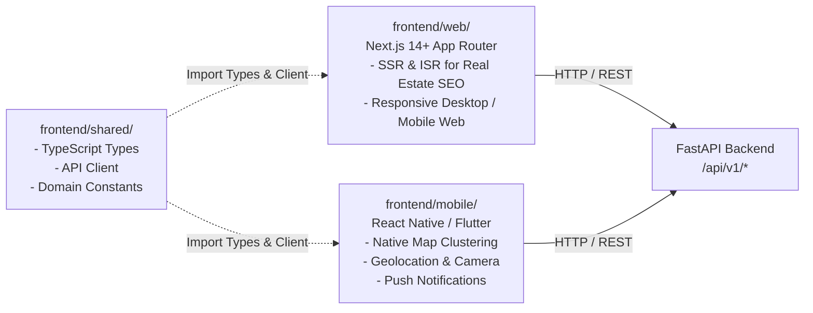

# Space247 Architecture Document 03: Cross-Platform Frontend Strategy

## 1. Overview & Architecture Strategy

The Space247 real estate platform adopts a **decoupled multi-platform frontend strategy**. Rather than forcing a single cross-platform framework across Web and Mobile, the platform leverages specialized client frameworks tailored to each platform's distinct strengths while binding them to unified backend contracts via a shared TypeScript module.

## 2. Platform-Specific Implementations

### A. Web Platform (`frontend/web/`)
- **Framework:** Next.js 14+ with App Router and Server Components.
- **Key Objectives:**
  - **SEO & Organic Discovery:** Real estate buyers search heavily on Google. Server-Side Rendering (SSR) and Incremental Static Regeneration (ISR) ensure dynamic property listing pages have complete OpenGraph metadata, structured JSON-LD schemas, and fast Core Web Vitals.
  - **Broker Backoffice & Portals:** Desktop-optimized management tables for property agents to upload multi-image listings, manage lease contracts, and review leads.
- **Key Libraries:** Tailwind CSS, shadcn/ui, TanStack Query, Leaflet / Mapbox GL.

### B. Mobile Platform (`frontend/mobile/`)
- **Framework:** React Native (Expo) or Flutter.
- **Key Objectives:**
  - **Location-Based Search:** Native geolocation hooks allowing users to discover properties within a 3km or 5km radius while driving through neighborhoods.
  - **High-Performance Map Interaction:** 60fps gesture dragging, pin clustering, and bottom sheet property drawers.
  - **Camera & Media Upload:** In-app photo taking with client-side image compression before uploading listing assets.
  - **Push Notifications:** Instant alerts on price reductions or new listings matching saved semantic searches.

## 3. Shared Contract Pattern (`frontend/shared/`)

To prevent API divergence and contract drift between web and mobile teams, all DTO interfaces and client communication routines reside in `frontend/shared/`:

- `types.ts`: Strictly typed interfaces (`PropertyResponse`, `PropertyCreate`, `SemanticSearchQuery`, `ListingType`) that mirror backend Pydantic models.
- `api-client.ts`: Lightweight, isomorphic API client using standard Web `fetch` and `AbortController`. Works in Node.js, browser environments, and React Native runtimes without polyfills.

## 4. State Management & Query Caching

Both platforms follow a consistent caching strategy:

1. **Server State (TanStack Query):**
   - Query keys reflect filter states: `["properties", { city, listing_type, page }]`.
   - Semantic search queries are keyed by vector checksums or query strings: `["semantic-search", queryHash]`.
   - Stale-time is set to 5 minutes for listing feeds, and 30 seconds for active pricing data.

2. **Client State (Zustand):**
   - Manages user preferences: active city, currency format (VND / USD), map view vs. list view toggle, and authenticated session tokens.

3. **Offline Resilience (Mobile):**
   - Bookmarked / saved listings are stored in local SQLite / AsyncStorage for viewing without an active internet connection.
