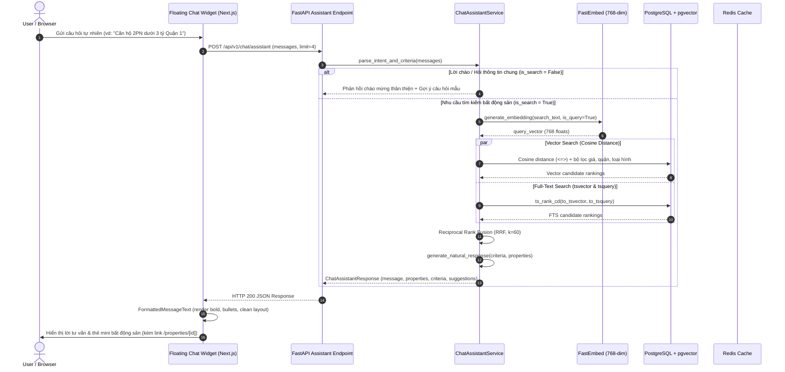

# Space247 Architecture Document 04: AI Chatbot Assistant & Conversational Discovery

## 1. Executive Summary & Intent

The **Space247 AI Chatbot Assistant** (`POST /api/v1/chat/assistant`) provides an intuitive, conversational real estate discovery experience. Instead of manually configuring complex search forms, users can describe their real estate requirements in colloquial Vietnamese (e.g., *"Tìm căn hộ 2 phòng ngủ giá dưới 3 tỷ ở Quận 1"* or *"Cần thuê nhà phố Bình Thạnh khoảng 15 triệu/tháng"*).

The assistant:
1. Analyzes conversation history and extracts structured criteria (listing type, property type, price limits, district/city, bedrooms, amenities).
2. Executes pgvector dense vector similarity and PostgreSQL Full-Text Search (FTS) with Reciprocal Rank Fusion (RRF).
3. Synthesizes a friendly, natural Vietnamese response highlighting top recommendations and renders interactive miniaturized property cards directly inside the chat window.

---

## 2. Conversational Architecture & Execution Flow



---

## 3. Data Contracts & API Schema

### 3.1. Request Schema (`ChatAssistantRequest`)

```json
{
  "messages": [
    {
      "role": "user",
      "content": "Tìm căn hộ 2 phòng ngủ giá dưới 3 tỷ ở Quận 1 TP.HCM"
    }
  ],
  "limit": 4
}
```

### 3.2. Response Schema (`ChatAssistantResponse`)

```json
{
  "message": "Dạ, Space247 đã tìm thấy **1 bất động sản** phù hợp với bán, căn hộ, khu vực Quận 1, từ 2 phòng ngủ, mức giá dưới 3 tỷ:\n\nNổi bật có căn **Căn hộ Vinhomes Golden River 2PN view sông** (Quận 1, Hồ Chí Minh) với giá 2.80 tỷ và diện tích 75.5m².\nBạn có thể bấm vào thẻ bài đăng bên dưới để xem chi tiết ảnh và vị trí trên bản đồ nhé!",
  "properties": [
    {
      "id": "c1f7a2d4-e8b2-4d1e-9f3a-5b6c7d8e9f01",
      "title": "Căn hộ Vinhomes Golden River 2PN view sông",
      "price": 2800000000.0,
      "currency": "VND",
      "listing_type": "sale",
      "property_type": "apartment",
      "area_sqm": 75.5,
      "num_bedrooms": 2,
      "address": "2 Tôn Đức Thắng",
      "district": "Quận 1",
      "city": "Hồ Chí Minh"
    }
  ],
  "criteria": {
    "listing_type": "sale",
    "property_type": "apartment",
    "city": "Hồ Chí Minh",
    "district": "Quận 1",
    "min_price": null,
    "max_price": 3000000000.0,
    "min_bedrooms": 2,
    "amenities": [],
    "raw_query": "căn hộ 2 phòng ngủ giá dưới 3 tỷ ở Quận 1 TP.HCM"
  },
  "suggestions": [
    "Xem thêm bất động sản cùng khu vực",
    "Lọc căn hộ giá thấp hơn",
    "Chỉ hiển thị nhà có đầy đủ nội thất"
  ]
}
```

---

## 4. Quy Tắc Trích Xuất Tiêu Chí (Criteria Extraction Engine)

Hệ thống trích xuất thông tin sử dụng bộ lọc nhận dạng mẫu tiếng Việt tự nhiên:

1. **Loại hình giao dịch (Listing Type)**:
   - Thuê: *"thuê", "cho thuê", "cần thuê", "tìm thuê", "mướn", "triệu/tháng", "tr/tháng"* $\rightarrow$ `ListingType.RENT`.
   - Mua/Bán: *"mua", "bán", "cần mua", "tìm mua", "chuyển nhượng", "tỷ"* $\rightarrow$ `ListingType.SALE`.
2. **Loại hình bất động sản (Property Type)**:
   - `apartment`: *"căn hộ", "chung cư", "condo", "penthouse", "studio"*.
   - `house`: *"nhà phố", "nhà riêng", "nhà hẻm", "nhà mặt tiền", "nhà nguyên căn"*.
   - `villa`: *"biệt thự", "villa"*.
   - `land`: *"đất nền", "đất thổ cư", "lô đất", "mảnh đất"*.
   - `commercial`: *"mặt bằng", "shophouse", "văn phòng", "thương mại", "ki-ốt"*.
3. **Mức giá (Price Normalization)**:
   - Đơn vị Tỷ: *"dưới 3 tỷ"* $\rightarrow$ `max_price = 3,000,000,000`; *"từ 2 đến 4 tỷ"* $\rightarrow$ `min_price = 2,000,000,000`, `max_price = 4,000,000,000`.
   - Đơn vị Triệu: *"khoảng 15 triệu"* $\rightarrow$ `min_price = 12,750,000`, `max_price = 17,250,000`.
4. **Địa điểm (Location)**:
   - Các quận trọng điểm tại TP.HCM (Quận 1 - 12, Bình Thạnh, Thủ Đức, Gò Vấp, Phú Nhuận...), Hà Nội (Cầu Giấy, Đống Đa, Ba Đình, Hoàn Kiếm, Nam Từ Liêm...), Đà Nẵng (Hải Châu, Sơn Trà...).
5. **Tiện ích (Amenities)**:
   - *"hồ bơi", "ban công", "gym", "nội thất", "sân vườn", "thang máy", "view sông", "công viên"...*

---

## 5. Thiết Kế Giao Diện Frontend (Floating Chat Widget)

Component [`ChatAssistantWidget.tsx`](file:///Users/hautp/Documents/Projects/Space247/frontend/web/src/components/ChatAssistantWidget.tsx) được thiết kế theo phong cách hiện đại và chuẩn mực:

1. **Bộ nhận diện Tư vấn viên Chuyên nghiệp**:
   - Sử dụng các icon `MessageSquareText`, `Headphones`, `Building2`, `Compass` thay cho các biểu tượng robot máy móc.
   - Nhãn hiển thị *"Tư vấn viên Space247"* với đèn tín hiệu trạng thái trực tuyến.
2. **Hỗ trợ 3 trạng thái kích thước**:
   - **Thu nhỏ (Minimized)**: Thanh taskbar gọn gàng ở góc dưới `w-80 h-14`.
   - **Kích thước chuẩn (Normal)**: Cửa sổ nổi `w-[390px] sm:w-[450px] h-[600px]`.
   - **Mở rộng toàn màn hình (Expanded)**: Cửa sổ mở rộng `w-[94vw] sm:w-[820px] lg:w-[980px] h-[86vh]` với danh sách bất động sản hiển thị dạng lưới 2 cột (`grid-cols-2`).
3. **Bộ chuyển đổi Markdown thẩm mỹ (`FormattedMessageText`)**:
   - Tự động chuyển `**in đậm**` thành thẻ `<strong>` có màu sắc trang nhã, không để lộ cú pháp thô.
   - Tự động căn lề và định dạng các danh sách gạch đầu dòng (`•`).
4. **Thẻ bất động sản thu nhỏ trực tiếp**:
   - Hiển thị ảnh đại diện (đã qua kiểm tra an toàn URL bằng `sanitizeUrl`), huy hiệu Bán/Thuê, giá tiền tiếng Việt, diện tích, phòng ngủ và vị trí.
   - Click vào thẻ để mở trang chi tiết bài đăng trong tab mới.
