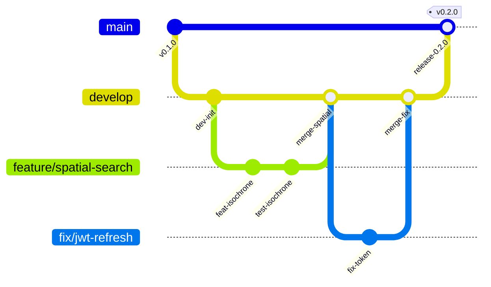

# Quy Chuẩn Lập Trình và Quy Tắc Git (Coding Standards & Git Rules)

Tài liệu này quy định các tiêu chuẩn bắt buộc về quản lý mã nguồn, quy ước thông điệp commit, phân nhánh Git, bảo mật thông tin nhạy cảm và các cổng kiểm soát chất lượng (Quality Gates) trong dự án Space247.

---

## 1. Quy Chuẩn Thông Điệp Commit (Conventional Commits)

Mọi commit đẩy lên kho lưu trữ phải tuân thủ chuẩn **Conventional Commits v1.0.0**:

```
<loại>(<phạm vi>): <mô tả ngắn gọn bằng thể mệnh lệnh>

[phần thân giải thích chi tiết lý do và ngữ cảnh - tùy chọn]

[phần chân ghi chú Breaking Changes hoặc mã số công việc - tùy chọn]
```

### 1.1. Danh mục các tiền tố commit (Type):
- **`feat`**: Phát triển tính năng mới cho người dùng hoặc hệ thống (ví dụ: `feat(spatial): add isochrone travel time search endpoint`).
- **`fix`**: Sửa lỗi chức năng hoặc lỗi cú pháp logic (ví dụ: `fix(auth): handle expired jwt token gracefully`).
- **`docs`**: Chỉ thay đổi hoặc bổ sung tài liệu kỹ thuật, README (ví dụ: `docs(api): document spatial and agent endpoints`).
- **`refactor`**: Tái cấu trúc mã nguồn mà không làm thay đổi hành vi nghiệp vụ bên ngoài (ví dụ: `refactor(database): optimize hnsw vector search query builder`).
- **`test`**: Bổ sung hoặc điều chỉnh các ca kiểm thử tự động (ví dụ: `test(agent): add test suite for avm pricing advisor`).
- **`chore`**: Công việc bảo trì định kỳ, cập nhật cấu hình build, dependency (ví dụ: `chore(deps): upgrade fastapi to version 0.115`).
- **`perf`**: Tối ưu hóa hiệu năng thực thi hoặc bộ nhớ đệm (ví dụ: `perf(cache): implement redis cache-aside for property details`).

### 1.2. Quy tắc viết mô tả commit:
- Luôn viết bằng thể mệnh lệnh ở thì hiện tại (ví dụ: `add`, `fix`, `update`, `refactor`, không dùng `added`, `fixes`).
- Không viết hoa chữ cái đầu tiên của mô tả ngắn gọn sau dấu hai chấm.
- Không đặt dấu chấm câu ở cuối tiêu đề commit.
- Giới hạn dòng tiêu đề tối đa trong 72 ký tự.

---

## 2. Quy Trình Phân Nhánh Git (Git Flow)

Hệ thống áp dụng mô hình phân nhánh linh hoạt dựa trên Git Flow tiêu chuẩn:



### 2.1. Quy ước đặt tên nhánh:
- Nhánh chính sản phẩm: `main` (chỉ chứa mã nguồn ổn định sẵn sàng triển khai).
- Nhánh phát triển tích hợp: `develop`.
- Nhánh tính năng: `feature/<tên-tính-năng>` (ví dụ: `feature/agent-avm-pricing`).
- Nhánh sửa lỗi: `fix/<tên-lỗi>` (ví dụ: `fix/search-empty-results`).
- Nhánh tối ưu/tài liệu: `chore/<nội-dung>` hoặc `docs/<nội-dung>`.

### 2.2. Quy trình kiểm duyệt (Pull Request / Merge Request):
- Không commit hoặc push trực tiếp vào nhánh `main`.
- Mọi thay đổi đều phải tạo Pull Request (PR) vào `develop`.
- PR chỉ được phép gộp (merge) khi:
  - Tất cả các bước kiểm tra tự động (CI Quality Gates) đạt 100% PASS.
  - Được ít nhất 1 kỹ sư thẩm định (Code Reviewer) chấp thuận.
  - Không có xung đột mã nguồn (merge conflicts) với nhánh đích.

---

## 3. Quy Tắc Bảo Mật & Quản Lý Thông Tin Nhạy Cảm (Secrets Management)

An toàn bảo mật là nguyên tắc bất di bất dịch trong suốt vòng đời dự án:

1. **Tuyệt đối không lưu trữ khóa bí mật trong mã nguồn (Zero Hardcoded Secrets)**:
   - Nghiêm cấm đưa trực tiếp chuỗi kết nối cơ sở dữ liệu có mật khẩu, khóa `SECRET_KEY` của JWT, hoặc khóa API bên ngoài (`GEMINI_API_KEY`) vào tệp mã nguồn Python, TypeScript hay Dart.
   - Tất cả thông tin nhạy cảm phải được định nghĩa trong tệp môi trường `.env` (đã được cấu hình trong `.gitignore`).
2. **Kiểm tra tệp mẫu `.env.example`**:
   - Tệp `.env.example` chỉ chứa cấu trúc khóa với giá trị giả lập hoặc giá trị mặc định cho môi trường phát triển cục bộ.
3. **Cấu hình `.gitignore` nghiêm ngặt**:
   - Luôn đảm bảo các tệp `.env`, `.env.local`, `.env.production`, thư mục `.venv`, `node_modules`, build artifacts của Flutter (`build/`, `.dart_tool/`) và các tệp khóa ký (`*.keystore`, `*.jks`, `*.p12`) đều nằm trong danh sách loại trừ của Git.
4. **Xử lý khi xảy ra sự cố lộ khóa (Secret Leak Incident)**:
   - Ngay lập tức thu hồi và tạo khóa thay thế mới trên dịch vụ cung cấp (Google AI Studio, Database, v.v.).
   - Sử dụng các công cụ làm sạch lịch sử Git (`git filter-repo` hoặc BFG Repo-Cleaner) để loại bỏ hoàn toàn vết commit chứa khóa nhạy cảm.

---

## 4. Cổng Kiểm Soát Chất Lượng Bắt Buộc (Strict Quality Gates)

Trước khi phát hành một bản cập nhật hoặc hoàn tất một phiên làm việc, toàn bộ ba phân hệ phải vượt qua các cổng kiểm chuẩn sau:

### 4.1. Phân hệ Backend (FastAPI & SQLAlchemy)
- **Lệnh thực thi**:
  ```bash
  cd backend && uv run pytest
  ```
- **Tiêu chuẩn**:
  - Tỷ lệ hoàn thành: **100% PASS** (101/101 test cases).
  - Không được phép bỏ qua (`@pytest.mark.skip`) hoặc xóa ca kiểm thử để đối phó.
  - Toàn bộ các kiểm thử di chuyển lược đồ (`test_alembic_migrations.py`) phải hoàn thành với mã thoát 0.

### 4.2. Phân hệ Frontend Web (Next.js 16 & React 19)
- **Lệnh thực thi**:
  ```bash
  cd frontend/web
  npx tsc --noEmit
  npm run build
  ```
- **Tiêu chuẩn**:
  - `npx tsc --noEmit`: 0 lỗi biên dịch TypeScript (`0 errors`).
  - `npm run build`: Biên dịch và tối ưu hóa thành công 100% các tuyến đường tĩnh và động mà không có cảnh báo nghiêm trọng.

### 4.3. Phân hệ Frontend Mobile (Flutter)
- **Lệnh thực thi**:
  ```bash
  cd frontend/mobile
  flutter analyze
  ```
- **Tiêu chuẩn**:
  - Kết quả phân tích tĩnh: **No issues found!** (0 errors, 0 fatal warnings).
  - Không để tồn tại các trường hoặc biến rác không được sử dụng (`unused_field`).

---

## 5. Quy Chuẩn Định Dạng Mã Nguồn (Code Formatting)

- **Python**: Tuân thủ chuẩn PEP 8, độ dài dòng tối đa 100 ký tự. Khuyến nghị sử dụng công cụ `ruff` để tự động định dạng và kiểm tra tĩnh.
- **TypeScript**: Tuân thủ cấu hình `tsconfig.json` nghiêm ngặt (`strict: true`), không sử dụng kiểu `any` tùy tiện ngoại trừ các tình huống bọc thư viện ngoài.
- **Dart**: Tuân thủ bộ quy tắc `package:flutter_lints/flutter.yaml`.
