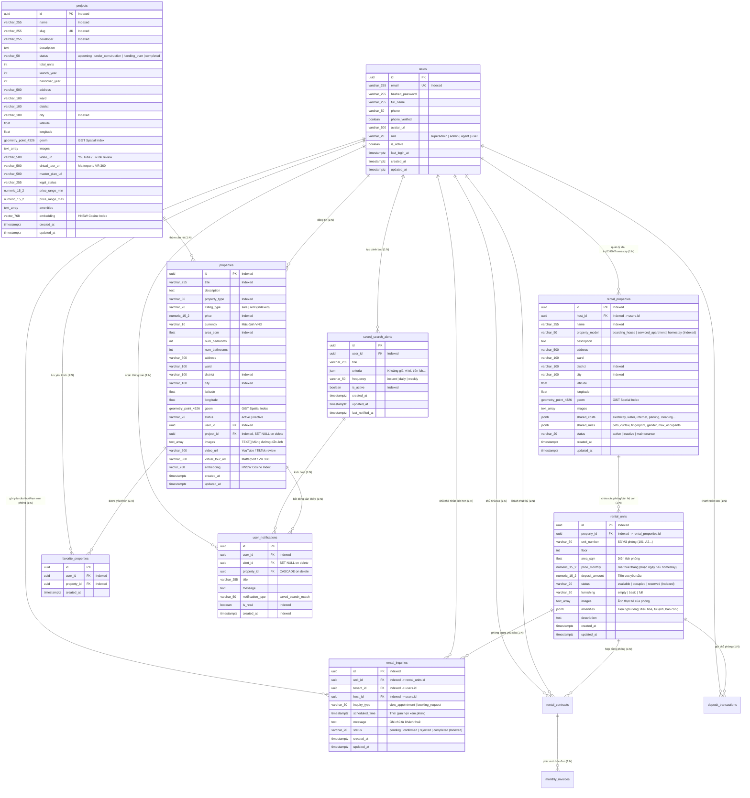

# Thiết Kế Cơ Sở Dữ Liệu Space247 (Database Design & ERD)

Hệ thống Space247 sử dụng PostgreSQL 16 kết hợp hai tiện ích mở rộng cốt lõi: `pgvector` (quản lý và lập chỉ mục vector đa chiều) và `PostGIS` (xử lý dữ liệu không gian và tính toán hình học).

---

## 1. Sơ Đồ Thực Thể Quan Hệ (Entity Relationship Diagram - ERD)



---

## 2. Chi Tiết Lược Đồ Các Bảng (Table Schemas)

### 2.1. Bảng `projects` (Dự án Bất động sản & Quy hoạch)
*Bổ sung trong Revision 0006*. Bảng lưu trữ toàn bộ thông tin đại đô thị, dự án chung cư cao tầng, khu đô thị phức hợp, mặt bằng tổng thể (master plan) và tiện ích nội khu.

| Tên cột | Kiểu dữ liệu | Ràng buộc | Mô tả |
|---|---|---|---|
| `id` | `UUID` | Primary Key, Default `uuid_generate_v4()` | Mã định danh dự án |
| `name` | `VARCHAR(255)` | NOT NULL | Tên thương mại dự án (chỉ mục B-Tree) |
| `slug` | `VARCHAR(255)` | NOT NULL, UNIQUE | Đường dẫn thân thiện URL duy nhất (chỉ mục B-Tree) |
| `developer` | `VARCHAR(255)` | NULL | Tên chủ đầu tư / tập đoàn phát triển (chỉ mục B-Tree) |
| `description` | `TEXT` | NULL | Bài viết giới thiệu chi tiết định dạng Markdown |
| `status` | `VARCHAR(50)` | NOT NULL, Default `'under_construction'` | Trạng thái: `upcoming`, `under_construction`, `handing_over`, `completed` |
| `total_units` | `INTEGER` | NULL | Tổng quy mô căn hộ/nhà phố dự kiến |
| `launch_year` | `INTEGER` | NULL | Năm khởi công mở bán |
| `handover_year` | `INTEGER` | NULL | Năm dự kiến/thực tế bàn giao |
| `address` | `VARCHAR(500)` | NOT NULL | Địa chỉ thực tế dự án |
| `ward` | `VARCHAR(100)` | NULL | Phường / Xã |
| `district` | `VARCHAR(100)` | NULL | Quận / Huyện (chỉ mục B-Tree) |
| `city` | `VARCHAR(100)` | NOT NULL | Tỉnh / Thành phố (chỉ mục B-Tree) |
| `latitude` | `FLOAT` | NULL | Tọa độ vĩ độ |
| `longitude` | `FLOAT` | NULL | Tọa độ kinh độ |
| `geom` | `geometry(Point, 4326)` | NULL | Điểm hình học PostGIS (chỉ mục GiST) |
| `images` | `TEXT[]` | NOT NULL, Default `'{}'` | Mảng URL phối cảnh và thực tế dự án |
| `video_url` | `VARCHAR(500)` | NULL | URL video review YouTube, Shorts hoặc TikTok |
| `virtual_tour_url` | `VARCHAR(500)` | NULL | URL tour ảo Matterport hoặc VR 360 |
| `master_plan_url` | `VARCHAR(500)` | NULL | URL ảnh sơ đồ mặt bằng tổng thể phân khu |
| `legal_status` | `VARCHAR(255)` | NULL | Tình trạng pháp lý (Sổ hồng lâu dài, 1/500...) |
| `price_range_min` | `NUMERIC(15, 2)` | NULL | Khoảng giá tham khảo thấp nhất (VND) |
| `price_range_max` | `NUMERIC(15, 2)` | NULL | Khoảng giá tham khảo cao nhất (VND) |
| `amenities` | `TEXT[]` | NOT NULL, Default `'{}'` | Mảng danh sách tiện ích nội khu dự án |
| `embedding` | `VECTOR(768)` | NULL | Vector ngữ nghĩa 768 chiều phục vụ tìm kiếm dự án (HNSW) |
| `created_at` | `TIMESTAMPTZ` | NOT NULL, Default `NOW()` | Thời điểm tạo dự án |
| `updated_at` | `TIMESTAMPTZ` | NOT NULL, Default `NOW()` | Thời điểm cập nhật dự án |

### 2.2. Bảng `properties` (Quản lý Bất động sản)
Bảng trung tâm lưu trữ toàn bộ dữ liệu thuộc tính, hình ảnh, tọa độ và vector nhúng của tin đăng.

| Tên cột | Kiểu dữ liệu | Ràng buộc | Mô tả |
|---|---|---|---|
| `id` | `UUID` | Primary Key, Default `uuid_generate_v4()` | Mã định danh duy nhất của bất động sản |
| `title` | `VARCHAR(255)` | NOT NULL | Tiêu đề tin đăng (được đánh chỉ mục B-Tree) |
| `description` | `TEXT` | NOT NULL | Mô tả chi tiết tin đăng (hỗ trợ định dạng Markdown) |
| `property_type` | `VARCHAR(50)` | NOT NULL | Phân loại BĐS: `apartment`, `house`, `villa`, `land`, `commercial` |
| `listing_type` | `VARCHAR(20)` | NOT NULL | Loại hình giao dịch: `sale` (bán) hoặc `rent` (cho thuê) |
| `price` | `NUMERIC(15, 2)` | NOT NULL | Giá niêm yết (hỗ trợ tới hàng trăm tỷ đồng) |
| `currency` | `VARCHAR(10)` | NOT NULL, Default `'VND'` | Đơn vị tiền tệ |
| `area_sqm` | `FLOAT` | NOT NULL | Diện tích sử dụng tính theo mét vuông (m²) |
| `num_bedrooms` | `INTEGER` | NULL | Số lượng phòng ngủ |
| `num_bathrooms` | `INTEGER` | NULL | Số lượng phòng tắm/vệ sinh |
| `address` | `VARCHAR(500)` | NOT NULL | Địa chỉ chi tiết số nhà, tên đường |
| `ward` | `VARCHAR(100)` | NULL | Phường / Xã |
| `district` | `VARCHAR(100)` | NULL | Quận / Huyện / Thị xã |
| `city` | `VARCHAR(100)` | NOT NULL | Tỉnh / Thành phố trực thuộc trung ương |
| `latitude` | `FLOAT` | NULL | Tọa độ vĩ độ (WGS84) |
| `longitude` | `FLOAT` | NULL | Tọa độ kinh độ (WGS84) |
| `geom` | `geometry(Point, 4326)` | NULL | Điểm hình học không gian PostGIS hệ quy chiếu WGS84 |
| `status` | `VARCHAR(20)` | NOT NULL, Default `'active'` | Trạng thái tin đăng: `active`, `pending`, `sold`, `inactive` |
| `user_id` | `UUID` | Foreign Key (`users.id`), ON DELETE SET NULL | Mã người dùng sở hữu/đăng tin |
| `project_id` | `UUID` | Foreign Key (`projects.id`), ON DELETE SET NULL, Indexed | Mã dự án chứa căn hộ (Revision 0006) |
| `images` | `TEXT[]` | NOT NULL, Default `'{}'` | Mảng danh sách URL hình ảnh của bất động sản |
| `video_url` | `VARCHAR(500)` | NULL | URL video review YouTube, Shorts hoặc TikTok |
| `virtual_tour_url` | `VARCHAR(500)` | NULL | URL tour ảo Matterport hoặc VR 360 |
| `embedding` | `VECTOR(768)` | NULL | Vector biểu diễn ngữ nghĩa 768 chiều |
| `created_at` | `TIMESTAMPTZ` | NOT NULL, Default `NOW()` | Thời điểm tạo bản ghi |
| `updated_at` | `TIMESTAMPTZ` | NOT NULL, Default `NOW()` | Thời điểm cập nhật lần cuối |

### 2.2. Bảng `users` (Quản lý Người dùng)
| Tên cột | Kiểu dữ liệu | Ràng buộc | Mô tả |
|---|---|---|---|
| `id` | `UUID` | Primary Key, Default `uuid_generate_v4()` | Mã định danh người dùng |
| `email` | `VARCHAR(255)` | NOT NULL, UNIQUE | Địa chỉ email dùng để đăng nhập |
| `hashed_password` | `VARCHAR(255)` | NOT NULL | Mật khẩu băm an toàn qua thuật toán bcrypt |
| `full_name` | `VARCHAR(255)` | NOT NULL | Họ và tên đầy đủ |
| `phone` | `VARCHAR(50)` | NULL | Số điện thoại liên hệ |
| `avatar_url` | `VARCHAR(500)` | NULL | Đường dẫn ảnh đại diện cá nhân |
| `role` | `VARCHAR(20)` | NOT NULL, Default `'user'` | Vai trò: `user` (người tìm nhà), `agent` (môi giới), `admin` (quản trị) |
| `is_active` | `BOOLEAN` | NOT NULL, Default `TRUE` | Trạng thái kích hoạt tài khoản |
| `created_at` | `TIMESTAMPTZ` | NOT NULL, Default `NOW()` | Thời điểm đăng ký |
| `updated_at` | `TIMESTAMPTZ` | NOT NULL, Default `NOW()` | Thời điểm cập nhật tài khoản |

### 2.3. Bảng `favorite_properties` (Lưu Bất động sản Yêu thích)
| Tên cột | Kiểu dữ liệu | Ràng buộc | Mô tả |
|---|---|---|---|
| `id` | `UUID` | Primary Key, Default `uuid_generate_v4()` | Khóa chính |
| `user_id` | `UUID` | Foreign Key (`users.id`), ON DELETE CASCADE | Người dùng lưu yêu thích |
| `property_id` | `UUID` | Foreign Key (`properties.id`), ON DELETE CASCADE | Bất động sản được lưu |
| `created_at` | `TIMESTAMPTZ` | NOT NULL, Default `NOW()` | Thời điểm đánh dấu yêu thích |

*Ràng buộc duy nhất*: `UNIQUE (user_id, property_id)` bảo đảm mỗi người dùng chỉ lưu yêu thích một BĐS một lần.

### 2.4. Bảng `saved_search_alerts` (Cảnh báo Tìm kiếm)
| Tên cột | Kiểu dữ liệu | Ràng buộc | Mô tả |
|---|---|---|---|
| `id` | `UUID` | Primary Key, Default `uuid_generate_v4()` | Mã cảnh báo |
| `user_id` | `UUID` | Foreign Key (`users.id`), ON DELETE CASCADE | Người dùng sở hữu cảnh báo |
| `title` | `VARCHAR(255)` | NOT NULL | Tên gợi nhớ cảnh báo (ví dụ: "Chung cư Cầu Giấy 4 tỷ") |
| `criteria` | `JSON / JSONB` | NOT NULL | Tiêu chí lọc JSON (city, district, price_min, price_max, area_min...) |
| `frequency` | `VARCHAR(50)` | NOT NULL, Default `'instant'` | Tần suất gửi thông báo (`instant`, `daily`, `weekly`) |
| `is_active` | `BOOLEAN` | NOT NULL, Default `TRUE` | Bật/tắt cảnh báo |
| `created_at` | `TIMESTAMPTZ` | NOT NULL, Default `NOW()` | Thời điểm thiết lập |
| `updated_at` | `TIMESTAMPTZ` | NOT NULL, Default `NOW()` | Thời điểm cập nhật |
| `last_notified_at` | `TIMESTAMPTZ` | NULL | Thời điểm gửi thông báo gần nhất |

### 2.5. Bảng `user_notifications` (Thông báo Nội bộ Hệ thống)
| Tên cột | Kiểu dữ liệu | Ràng buộc | Mô tả |
|---|---|---|---|
| `id` | `UUID` | Primary Key, Default `uuid_generate_v4()` | Mã thông báo |
| `user_id` | `UUID` | Foreign Key (`users.id`), ON DELETE CASCADE | Người nhận thông báo |
| `alert_id` | `UUID` | Foreign Key (`saved_search_alerts.id`), ON DELETE SET NULL | Cảnh báo nguồn phát sinh thông báo |
| `property_id` | `UUID` | Foreign Key (`properties.id`), ON DELETE CASCADE | Bất động sản mới kích hoạt thông báo |
| `title` | `VARCHAR(255)` | NOT NULL | Tiêu đề thông báo |
| `message` | `TEXT` | NOT NULL | Nội dung tóm tắt thông báo |
| `notification_type` | `VARCHAR(50)` | NOT NULL, Default `'saved_search_match'` | Loại thông báo |
| `is_read` | `BOOLEAN` | NOT NULL, Default `FALSE` | Trạng thái đã xem |
| `created_at` | `TIMESTAMPTZ` | NOT NULL, Default `NOW()` | Thời điểm tạo thông báo |

---

## 3. Các Kiểu Dữ Liệu Đặc Thù

1. **`VECTOR(768)`**:
   - Kiểu dữ liệu mảng float nhị phân nén do `pgvector` cung cấp.
   - Lưu trữ trực tiếp vector ngữ nghĩa 768 chiều sinh ra từ mô hình `sentence-transformers/paraphrase-multilingual-mpnet-base-v2`.
   - Tính toán khoảng cách thông qua toán tử Cosine Distance (`<=>`), Inner Product (`<#>`), hoặc L2 Distance (`<->`).
2. **`geometry(Point, 4326)`**:
   - Kiểu dữ liệu hình học thực của `PostGIS` sử dụng hệ quy chiếu toàn cầu WGS84 (EPSG:4326).
   - Tọa độ được lưu trữ dưới dạng cặp `(Longitude, Latitude)`.
   - Hỗ trợ các phép toán không gian tính theo mét thực trên hình cầu: `ST_DWithin`, `ST_Distance`, `ST_Contains`.
3. **`images TEXT[]`**:
   - Kiểu mảng native của PostgreSQL (`ARRAY(TEXT)`), cho phép một bài đăng lưu trữ danh sách không giới hạn các đường dẫn ảnh mà không cần tạo bảng phụ trợ gây suy giảm hiệu năng kết nối bảng (JOIN overhead).

---

## 4. Chiến Lược Chỉ Mục Tối Ưu (Index Strategy)

Hệ thống được thiết kế danh mục chỉ mục chuyên biệt cho từng bài toán truy vấn:

| Tên chỉ mục | Bảng | Loại chỉ mục | Cột / Biểu thức | Mục đích tối ưu |
|---|---|---|---|---|
| `ix_properties_embedding_hnsw` | `properties` | **HNSW** | `embedding vector_cosine_ops` | Tăng tốc tìm kiếm vector tương đồng ngữ nghĩa. Cấu hình: `m=16, ef_construction=64`. |
| `idx_properties_geom` | `properties` | **GiST** | `geom` | Tăng tốc tìm kiếm không gian, bán kính lân cận (`ST_DWithin`) và bao đóng đa giác (`ST_Contains`). |
| `ix_properties_fts` | `properties` | **GIN** | `to_tsvector('simple', title || address || description)` | Tăng tốc tìm kiếm toàn văn tiếng Việt đa trường với cấu hình từ điển `simple`. |
| `ix_properties_city` | `properties` | **B-Tree** | `city` | Tối ưu lọc nhanh theo thành phố |
| `ix_properties_district` | `properties` | **B-Tree** | `district` | Tối ưu lọc theo quận/huyện |
| `ix_properties_price` | `properties` | **B-Tree** | `price` | Tối ưu lọc theo khoảng giá và sắp xếp tăng/giảm |
| `ix_properties_area_sqm` | `properties` | **B-Tree** | `area_sqm` | Tối ưu lọc theo diện tích |
| `ix_properties_user_id` | `properties` | **B-Tree** | `user_id` | Tối ưu truy vấn danh sách bài đăng của một môi giới (My Properties) |
| `uq_favorite_user_property` | `favorite_properties` | **B-Tree** | `user_id, property_id` | Đảm bảo tính duy nhất và tăng tốc kiểm tra trạng thái yêu thích |
| `ix_user_notifications_unread`| `user_notifications`| **B-Tree** | `user_id, is_read` | Tối ưu đếm số lượng thông báo chưa đọc trên thanh điều hướng |

---

## 5. Lịch Sử Quản Lý Lược Đồ (Alembic Migrations)

Toàn bộ các bước tiến hóa cơ sở dữ liệu được phiên bản hóa trong `backend/migrations/versions/`:

1. **`0001_initial_pgvector_properties.py`**:
   - Tạo các extension `vector` và `postgis`.
   - Tạo bảng `properties` với các cột cơ bản, cột `geom` và cột `embedding`.
   - Thiết lập chỉ mục HNSW vector cosine và GiST spatial.
2. **`0002_add_users_table_and_property_user_fk.py`**:
   - Tạo bảng `users` với phân quyền vai trò (`user`, `agent`, `admin`).
   - Thêm cột `user_id` vào `properties` và tạo ràng buộc khóa ngoại `fk_properties_user_id`.
3. **`0003_add_favorite_properties.py`**:
   - Tạo bảng `favorite_properties` với ràng buộc khóa ngoại kép tới `users` và `properties`.
4. **`0004_add_alerts_and_notifications.py`**:
   - Tạo bảng `saved_search_alerts` và `user_notifications` phục vụ hệ sinh thái giữ chân người dùng.
5. **`0005_add_property_images_and_user_avatar.py`**:
   - Bổ sung cột mảng `images TEXT[]` vào `properties`.
   - Bổ sung cột `avatar_url VARCHAR(500)` vào `users`.
6. **`0006_add_projects_table_and_property_project_fk.py`**:
   - Tạo bảng `projects` đại diện cho các đại đô thị và dự án chung cư lớn với vector 768-dim và PostGIS GiST.
   - Bổ sung cột khóa ngoại `project_id` vào bảng `properties`.
7. **`0007_user_management_superadmin_rbac.py`**:
   - Mở rộng phân quyền vai trò người dùng hỗ trợ cấp quản trị tối cao (`superadmin`).
   - Bổ sung các cột trạng thái định danh: `phone_verified` (Boolean) và `last_login_at` (TIMESTAMPTZ).
   - Thiết lập chỉ mục B-Tree `ix_users_role` trên bảng `users` tối ưu lọc theo nhóm quyền quản trị.
8. **`0012_add_media_urls.py`**:
   - Bổ sung `video_url VARCHAR(500)` và `virtual_tour_url VARCHAR(500)` cho `properties` và `projects`.
   - Giữ nguyên `images TEXT[]` để lưu danh sách URL ảnh.


## Rental and serviced apartment metadata

Migration `0008` adds nullable `properties.rental_type VARCHAR(50)`, `rental_costs JSONB`,
and `rental_rules JSONB`, plus the B-tree index `(listing_type, rental_type, price)`.
It alters the existing `listing_type` default to `sale`; existing `sale`/`rent` rows
are preserved. Downgrading 0008 removes only its metadata/index and restores the
previous absent default; it retains `listing_type`. Vectors remain 768-dimensional.

Rental subtypes: `room`, `serviced_apartment`, `house_share`, `entire_house`.
Rental price is monthly VND; rental create/update requests reject other currencies. All metadata is optional, including for legacy rows.
Missing/null values mean unknown; `0` is a known zero charge and `false` is a known
negative rule. No unknown charge is treated as free and no unknown amenity is shown
as a positive badge.

`rental_costs`: `electricity_per_kwh` (VND/kWh), `electricity_billing` (`state_rate` or
`fixed`), `water_cost`, `water_unit` (`per_m3`: VND/m³, `per_person`: VND/person/month),
`parking_fee_monthly`, `service_fee_monthly` (VND/month), and `deposit_months` (months).
All numeric costs must be finite and nonnegative. Deposit amount = monthly rent ×
deposit months. Electricity and water cannot be added to a monthly total without
usage/person counts; if water billing is absent, its unit remains unknown.

`rental_rules`: nullable booleans `curfew`, `private_bathroom`, `allow_pets`, `has_mezzanine`,
`has_washing_machine`, `live_with_owner`, `has_elevator`, `fingerprint_lock`;
`curfew_time` uses 24-hour HH:MM; `max_occupants` is a positive integer.
`curfew_time` is accepted only when `curfew` is true.

Create/update requests and property responses carry these objects. Omitted update
fields (including nested cost/rule keys) are preserved; explicit null clears a
field or entire object. Changing to sale clears all rental metadata. Changes to
rental metadata refresh embeddings and invalidate property/search caches.

GET `/api/v1/properties`, POST `/api/v1/properties/search`, POST
`/api/v1/search/semantic`, and chat share exact rental predicates:
`rental_type`, all eight boolean rule keys, `electricity_billing`, and `max_deposit`
(in **months**, not VND). Explicit predicates exclude unknown keys and require
active rental listings before ranking/limits. GET also supports `min_price` and
`max_price`. Boolean false and deposit ceiling zero are transmitted unchanged.

`near_landmark` is geocoded and filtered through PostGIS `ST_DWithin` with
`radius_km` defaulting to 3.0. Bách Khoa resolves to Hanoi University of Science and
Technology. If geocoding fails, natural-language search retains the landmark in
its semantic query. GET and vector-only requests return 422 when a landmark cannot be resolved, preventing unrelated location results. Web/mobile rental discovery and chat share structured filters.

Example rental metadata:
```json
{
  "listing_type": "rent",
  "rental_type": "room",
  "price": 3000000,
  "rental_costs": {"electricity_billing": "state_rate", "service_fee_monthly": 0, "deposit_months": 2},
  "rental_rules": {"has_mezzanine": true, "allow_pets": false, "curfew_time": "23:00", "max_occupants": 2}
}
```

Example discovery request:
```json
{"query":"phòng trọ gần Bách Khoa", "listing_type":"rent", "has_mezzanine":true, "allow_pets":false, "max_price":5000000, "max_deposit":2, "electricity_billing":"state_rate", "near_landmark":"Bách Khoa", "radius_km":3}
```

Review migration SQL locally with `cd backend` then
`uv run alembic upgrade head --sql` and
`uv run alembic downgrade 0008:0007 --sql`. Apply `uv run alembic upgrade head`
only to an explicitly selected development database after review. Implementation
verification does not migrate any live database; offline SQL tests do not prove
execution on PostgreSQL/PostGIS.

---

## 3. Phân Hệ Cho Thuê 2 Chiều: Tòa Nhà/Khu Trọ & Phòng Đơn Lẻ (Migration 0009)

Hệ thống bổ sung cấu trúc quan hệ phân cấp 1-nhiều rõ ràng giữa Tòa nhà / Khu trọ (`rental_properties`) và Từng phòng / Căn hộ con (`rental_units`), hỗ trợ 3 mô hình kinh doanh chính:
1. **Phòng trọ / Nhà trọ (`boarding_house`)**: Thường dùng chung tiện ích tòa nhà, tính tiền theo tháng.
2. **Căn hộ dịch vụ (`serviced_apartment`)**: Đầy đủ nội thất, dịch vụ dọn phòng, tính tiền theo tháng/quý.
3. **Homestay (`homestay`)**: Phục vụ lưu trú ngắn hạn theo đêm hoặc dài hạn theo tuần/tháng.

### Bảng `rental_properties` (Tòa nhà / Khu trọ / Cơ sở homestay)
- Quản lý thông tin chung toàn khu: tên tòa nhà, địa chỉ, quận/huyện, tọa độ `geom (Point, 4326)` có GiST spatial index.
- Liên kết với chủ nhà thông qua `host_id` (tham chiếu `users.id`, vai trò `host` hoặc `agent`).
- `shared_costs` (JSONB): Biểu phí chung áp dụng toàn tòa nhà:
  - `electricity`: `{ "rate": 3500, "unit": "kWh", "billing_type": "meter" }`
  - `water`: `{ "rate": 100000, "unit": "person_month", "billing_type": "fixed" }`
  - `internet`: `{ "rate": 100000, "unit": "room_month" }`
  - `parking`: `{ "rate": 120000, "unit": "bike_month" }`
  - `service_fee`: `{ "rate": 50000, "unit": "room_month" }`
- `shared_rules` (JSONB): Nội quy chung toàn khu:
  - `pets_allowed` (boolean), `curfew` (boolean), `curfew_time` (chuỗi HH:mm), `fingerprint_access` (boolean), `gender_restriction` ("none" | "female_only" | "male_only"), `max_occupants_per_room` (int).

### Bảng `rental_units` (Phòng / Căn hộ thành viên)
- Liên kết 1-nhiều với `rental_properties` qua `property_id` (CASCADE on delete).
- `unit_number`: Mã hoặc số phòng (VD: "P.201", "Studio 3A").
- `floor`: Tầng lầu (int).
- `area_sqm`: Diện tích thực tế sử dụng (m²).
- `price_monthly`: Giá thuê theo tháng (hoặc giá/đêm đối với mô hình Homestay).
- `deposit_amount`: Số tiền cọc quy định (VND).
- `status`: Trạng thái thực tế của phòng:
  - `"available"`: Còn trống, sẵn sàng cho khách thuê.
  - `"occupied"`: Đã có người thuê (loại khỏi danh sách tìm kiếm phòng trống).
  - `"reserved"`: Đang có khách giữ chỗ / đặt cọc tạm thời.
- `furnishing`: Mức độ nội thất (`"empty"`, `"basic"`, `"full"`).
- `images`: Mảng ảnh thực tế của từng phòng riêng biệt.

### Bảng `rental_inquiries` (Lịch hẹn & Yêu cầu thuê)
- Kết nối trực tiếp Khách thuê (`tenant_id`), Chủ nhà (`host_id`), và Phòng cụ thể (`unit_id`).
- `inquiry_type`:
  - `"view_appointment"`: Đặt lịch hẹn xem phòng trực tiếp.
  - `"booking_request"`: Gửi yêu cầu đặt phòng / giữ chỗ.
- `scheduled_time`: Thời gian khách mong muốn đến xem phòng hoặc nhận phòng.
- `message`: Lời nhắn hoặc yêu cầu thêm từ khách thuê.
- `status`: Quy trình xử lý yêu cầu (`"pending"` -> `"confirmed"` | `"rejected"` -> `"completed"`).

---

## 4. Phân Hệ Quản Lý Hợp Đồng, Hóa Đơn Điện Nước & Đặt Cọc VietQR (Migration 0010)

Hệ thống bổ sung chu trình hoàn chỉnh từ lúc khách đặt cọc giữ chỗ tới khi vào ở, chốt số điện nước và thanh toán định kỳ hàng tháng:

### 4.1. Bảng `rental_contracts` (Hợp đồng Thuê Nhà/Phòng)
| Tên cột | Kiểu dữ liệu | Ràng buộc | Mô tả |
|---|---|---|---|
| `id` | `UUID` | Primary Key | Mã định danh hợp đồng |
| `unit_id` | `UUID` | FK (`rental_units.id`), CASCADE, Indexed | Phòng thuê |
| `property_id` | `UUID` | FK (`rental_properties.id`), CASCADE, Indexed | Khu trọ / Tòa nhà |
| `host_id` | `UUID` | FK (`users.id`), CASCADE, Indexed | Chủ nhà / Ban quản lý |
| `tenant_id` | `UUID` | FK (`users.id`), CASCADE, Indexed | Khách thuê phòng |
| `tenant_name` | `VARCHAR(255)` | NOT NULL | Họ và tên người thuê |
| `tenant_phone` | `VARCHAR(50)` | NOT NULL | Số điện thoại liên hệ |
| `start_date` | `DATE` | NOT NULL | Ngày bắt đầu tính tiền thuê |
| `end_date` | `DATE` | NULL | Ngày kết thúc hợp đồng dự kiến |
| `rental_price` | `NUMERIC(15, 2)` | NOT NULL | Tiền thuê phòng hàng tháng (VND) |
| `deposit_amount` | `NUMERIC(15, 2)` | NOT NULL, Default `0` | Tiền cọc hợp đồng |
| `payment_cycle_months` | `INTEGER` | NOT NULL, Default `1` | Chu kỳ đóng tiền (1, 3, 6, 12 tháng) |
| `electricity_rate` | `NUMERIC(15, 2)` | NOT NULL, Default `3500` | Đơn giá điện (đ/kWh) |
| `water_rate` | `NUMERIC(15, 2)` | NOT NULL, Default `20000` | Đơn giá nước (đ/m³ hoặc đ/người) |
| `water_billing_type` | `VARCHAR(50)` | NOT NULL, Default `'per_m3'` | Phân loại tính nước (`per_m3`, `fixed_per_person`) |
| `service_fee` | `NUMERIC(15, 2)` | NOT NULL, Default `0` | Phí dịch vụ cố định hàng tháng |
| `status` | `VARCHAR(50)` | NOT NULL, Default `'active'` | Trạng thái: `active`, `expired`, `terminated` |
| `created_at` | `TIMESTAMPTZ` | NOT NULL, Default `NOW()` | Thời gian tạo hợp đồng |
| `updated_at` | `TIMESTAMPTZ` | NOT NULL, Default `NOW()` | Thời gian cập nhật hợp đồng |

### 4.2. Bảng `monthly_invoices` (Hóa Đơn Thu Phí & Tiền Điện Nước Hàng Tháng)
| Tên cột | Kiểu dữ liệu | Ràng buộc | Mô tả |
|---|---|---|---|
| `id` | `UUID` | Primary Key | Mã định danh hóa đơn |
| `contract_id` | `UUID` | FK (`rental_contracts.id`), CASCADE, Indexed | Hợp đồng phát sinh hóa đơn |
| `unit_id` | `UUID` | FK (`rental_units.id`), CASCADE, Indexed | Phòng trọ |
| `host_id` | `UUID` | FK (`users.id`), CASCADE, Indexed | Chủ nhà nhận thanh toán |
| `tenant_id` | `UUID` | FK (`users.id`), CASCADE, Indexed | Khách thuê thanh toán |
| `billing_month` | `VARCHAR(7)` | NOT NULL, Indexed | Tháng tính phí định dạng `YYYY-MM` |
| `room_amount` | `NUMERIC(15, 2)` | NOT NULL | Tiền phòng tháng này |
| `electricity_previous_index` | `NUMERIC(10, 2)` | NOT NULL | Chỉ số điện đồng hồ cũ |
| `electricity_current_index` | `NUMERIC(10, 2)` | NOT NULL | Chỉ số điện đồng hồ mới |
| `electricity_rate` | `NUMERIC(15, 2)` | NOT NULL | Đơn giá điện áp dụng |
| `electricity_amount` | `NUMERIC(15, 2)` | NOT NULL | Thành tiền điện tính được |
| `water_previous_index` | `NUMERIC(10, 2)` | NULL | Chỉ số nước cũ (nếu có) |
| `water_current_index` | `NUMERIC(10, 2)` | NULL | Chỉ số nước mới (nếu có) |
| `water_rate` | `NUMERIC(15, 2)` | NOT NULL | Đơn giá nước |
| `water_amount` | `NUMERIC(15, 2)` | NOT NULL | Thành tiền nước |
| `service_amount` | `NUMERIC(15, 2)` | NOT NULL, Default `0` | Tiền dịch vụ chung |
| `other_amount` | `NUMERIC(15, 2)` | NOT NULL, Default `0` | Phụ thu phát sinh |
| `total_amount` | `NUMERIC(15, 2)` | NOT NULL | Tổng số tiền phải nộp |
| `status` | `VARCHAR(50)` | NOT NULL, Default `'pending'` | Trạng thái: `pending`, `paid`, `overdue`, `cancelled` |
| `due_date` | `DATE` | NOT NULL | Hạn chót đóng tiền |
| `paid_at` | `TIMESTAMPTZ` | NULL | Thời điểm khách thanh toán |
| `notes` | `TEXT` | NULL | Ghi chú thêm |
| `last_reminded_at` | `TIMESTAMPTZ` | NULL | Lần cuối chủ nhà gửi thông báo nhắc nợ |
| `created_at` | `TIMESTAMPTZ` | NOT NULL, Default `NOW()` | Thời gian tạo hóa đơn |
| `updated_at` | `TIMESTAMPTZ` | NOT NULL, Default `NOW()` | Thời gian cập nhật |

### 4.3. Bảng `deposit_transactions` (Giao Dịch Đặt Cọc Giữ Chỗ VietQR)
| Tên cột | Kiểu dữ liệu | Ràng buộc | Mô tả |
|---|---|---|---|
| `id` | `UUID` | Primary Key | Mã định danh giao dịch |
| `unit_id` | `UUID` | FK (`rental_units.id`), CASCADE, Indexed | Phòng đặt cọc |
| `inquiry_id` | `UUID` | FK (`rental_inquiries.id`), SET NULL, Indexed | Yêu cầu thuê liên kết |
| `tenant_id` | `UUID` | FK (`users.id`), CASCADE, Indexed | Khách thuê nộp cọc |
| `host_id` | `UUID` | FK (`users.id`), CASCADE, Indexed | Chủ nhà thụ hưởng |
| `amount` | `NUMERIC(15, 2)` | NOT NULL | Số tiền đặt cọc |
| `reference_code` | `VARCHAR(50)` | NOT NULL, UNIQUE, Indexed | Mã tham chiếu duy nhất (VD: `DEP...`) |
| `payment_method` | `VARCHAR(50)` | NOT NULL, Default `'vietqr'` | Phương thức thanh toán |
| `vietqr_url` | `TEXT` | NOT NULL | Link ảnh VietQR Napas 247 QuickLink |
| `status` | `VARCHAR(50)` | NOT NULL, Default `'pending'`, Indexed | Trạng thái: `pending`, `success`, `expired`, `failed` |
| `expires_at` | `TIMESTAMPTZ` | NOT NULL, Indexed | Thời điểm hết hạn hiệu lực giao dịch (15 phút) |
| `paid_at` | `TIMESTAMPTZ` | NULL | Thời điểm thanh toán thành công |
| `created_at` | `TIMESTAMPTZ` | NOT NULL, Default `NOW()` | Thời gian tạo giao dịch |


