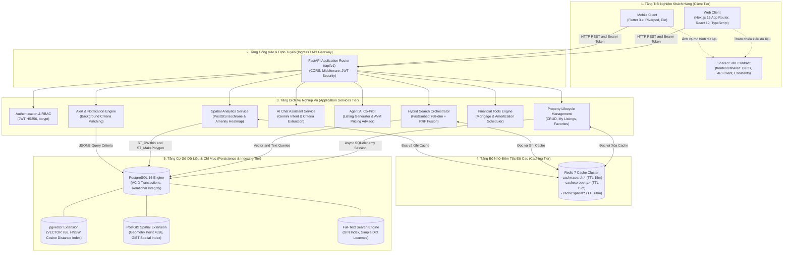
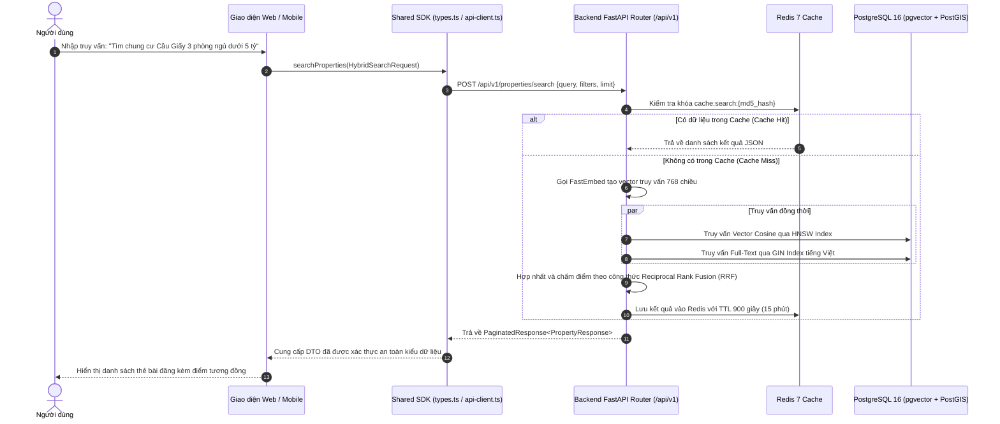
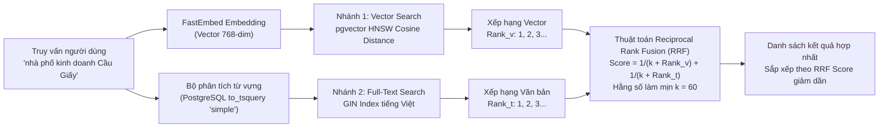

# Kiến Trúc Hệ Thống Space247 (System Architecture)

## 1. Mô Hình Kiến Trúc Phân Tầng (Multi-Tier Layered Architecture)

Space247 được thiết kế theo kiến trúc hướng dịch vụ phân tầng (Layered Service-Oriented Architecture), tối ưu hóa cho khả năng mở rộng, độ trễ thấp và tính nhất quán dữ liệu cao.

---

## 2. Luồng Dữ Liệu Qua Hợp Đồng Dùng Chung (Data Flow via Shared SDK)

Nhằm loại bỏ rủi ro sai lệch cấu trúc dữ liệu giữa giao diện Web và ứng dụng Di động, dự án áp dụng mô hình Hợp đồng Dùng chung (Single Source of Truth) tại `frontend/shared/`:

---

## 3. Chiến Lược Bộ Nhớ Đệm (Caching Strategy)

Hệ thống triển khai mẫu kiến trúc **Cache-aside** (Lazy Loading) kết hợp cơ chế **Chủ động Vô hiệu hóa (Proactive Cache Invalidation)**:

### 3.1. Cấu Trúc Khóa Cache (Key Namespaces)
- `cache:search:{hash}`: Lưu kết quả các truy vấn tìm kiếm ngữ nghĩa và tìm kiếm lai. Khóa được tạo từ mã băm MD5 của chuỗi truy vấn kèm bộ lọc.
  - **Thời gian sống (TTL)**: 900 giây (15 phút).
- `cache:property:{property_id}`: Lưu dữ liệu chi tiết của từng bất động sản đơn lẻ.
  - **Thời gian sống (TTL)**: 900 giây (15 phút).
- `cache:spatial:{hash}`: Lưu kết quả tính toán vùng di chuyển Isochrone và bản đồ nhiệt tiện ích (POI Heatmap).
  - **Thời gian sống (TTL)**: 3600 giây (60 phút) do hạ tầng giao thông và tiện ích ít biến động.

### 3.2. Cơ Chế Vô Hiệu Hóa (Invalidation Rules)
Khi có bất kỳ hành vi thay đổi dữ liệu nào (Thêm mới, Cập nhật, Xóa bài đăng):
1. **Xóa trực tiếp**: Gọi `cache_delete(f"cache:property:{property_id}")` để loại bỏ bản ghi chi tiết đã cũ.
2. **Quét và xóa hàng loạt**: Gọi hàm quét mẫu `cache_delete_pattern("cache:search:*")` để hủy bỏ các kết quả tìm kiếm đã lưu trong bộ nhớ đệm, bảo đảm người dùng luôn nhận được dữ liệu mới nhất trong lần tìm kiếm tiếp theo.

---

## 4. Cơ Chế Tìm Kiếm Lai RRF (Hybrid Search with Reciprocal Rank Fusion)

Để đạt được độ chính xác cao nhất đối với ngôn ngữ tiếng Việt (bao gồm cả từ khóa địa lý cụ thể lẫn mô tả nhu cầu trừu tượng), hệ thống kết hợp song song hai nhánh tìm kiếm:

### Công Thức Toán Học Reciprocal Rank Fusion (RRF)
Điểm số hợp nhất của một tài liệu $d$ được tính theo công thức:
$$RRF(d) = \sum_{m \in M} \frac{1}{k + r_m(d)}$$
Trong đó:
- $M$: Tập hợp các phương thức xếp hạng bao gồm $\{VectorSearch, FullTextSearch\}$.
- $r_m(d)$: Thứ hạng của tài liệu $d$ trong danh sách kết quả của phương thức $m$ (bắt đầu từ $1$).
- $k$: Hằng số làm mịn (smoothing factor), được cấu hình mặc định là $60$ theo chuẩn nghiên cứu của Cormack et al. nhằm giảm thiểu độ lệch của các kết quả cá biệt ở đầu danh sách.

### Lợi Ích Của Kiến Trúc RRF
1. **Khắc phục điểm yếu của Vector thuần túy**: Vector Embedding có thể bỏ sót các mã dự án hoặc tên phố hiếm gặp; Full-Text Search xử lý hoàn hảo trường hợp này.
2. **Khắc phục điểm yếu của Tìm kiếm từ khóa**: Khi người dùng mô tả nhu cầu phong cách sống hoặc tiện ích tương đương mà không gõ đúng từ khóa, Vector Cosine bù đắp độ tương đồng ngữ nghĩa.
3. **Không phụ thuộc thang điểm tuyệt đối**: RRF chỉ quan tâm tới thứ hạng tương đối của từng kết quả, giúp triệt tiêu sự khác biệt về phân phối điểm số giữa khoảng cách Cosine và điểm số ts_rank.
